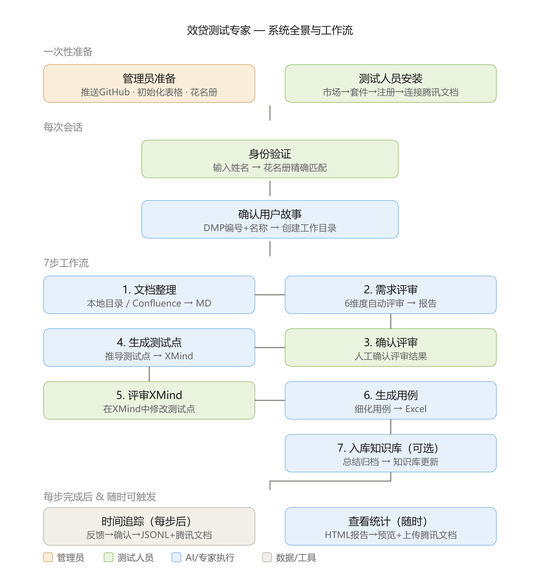

# 效贷功能测试专家 — 测试人员使用指导手册

> **版本**：v1.6.4 | **适用对象**：效贷业务线功能测试人员 | **更新日期**：2026-08-21

---

## 一、专家简介

**效贷功能测试专家**是效贷业务线专用的 AI 测试助手，内置从需求文档到测试用例入库的端到端工作流。

| 能力 | 说明 |
|------|------|
| 需求文档整理 | 将 Word/PDF/图片/Excel 或 Confluence 页面统一整理为结构化 Markdown |
| 需求评审 | 6 维度自动评审，输出评审报告 |
| 测试点生成 | 基于需求+评审+知识库推导测试点，输出 XMind 脑图 |
| 测试用例生成 | 将测试点细化为可执行的测试用例 Excel |
| 知识入库 | 将测试经验沉淀到知识库，供后续复用 |
| 时间节省追踪 | 自动记录每一步节省的时间，生成团队效能报告 |

**谁能使用**：效贷测试专家通过**花名册**控制访问权限（v1.5.2 起实时查 MySQL `agent_team_roster` 表），只有名单内的人员才能使用。输入姓名进行身份验证，匹配通过即可使用。

---

## 一-B、系统全景与工作流概览（培训专用）

> 本节帮助你从顶层视角理解效贷测试专家的运作方式：涉及哪些工具、你在流程中需要做什么。适合培训时快速建立全局认知。



### 1. 你需要了解的工具

你不需要深入了解所有技术细节，但需要知道以下工具各自负责什么：

| 工具 | 它负责什么 | 你需要做什么 |
|------|-----------|-------------|
| **WorkBuddy** | 运行平台，提供对话界面和专家管理 | 在里面安装专家、对话使用 |
| **效贷测试专家** | AI 大脑，执行7步工作流 | 对话交互，按指令推进流程 |
| **GitHub 团队市场** | 专家包的"应用商店"，分发最新版本 | 添加市场源（安装时一次） |
| **注册脚本** | 安装桥接，让专家出现在「我的专家」中 | 下载运行一次（安装/更新时） |
| **Confluence MCP 连接器** | 步骤①的入口B，读取 Confluence 页面 | 配置一次（如需用 Confluence 入口） |
| **腾讯文档连接器** | HTML 报告在线查看（推荐） | 授权一次（用于在线查看时间节省报告） |
| **MySQL 共享数据库** | 节省时间数据汇总存储（v1.5.0 起，取代腾讯文档智能表格） | 首次使用 AI 自动初始化（见 5.4，手动备选） |
| **Python 脚本（内置）** | 文档转换、评审报告、XMind、Excel、报告生成 | 无需操作，AI 自动调用 |
| **XMind 软件** | 步骤⑤中修改测试点 | 安装 XMind，打开文件修改 |
| **HTML 分析报告** | 时间节省可视化报告 | 说"查看时间节省统计"即可生成 |
| **本地工作目录** | 存放各步骤产出文件 | 无需操作，AI 自动创建和管理 |

### 2. 工作流全景图（测试人员视角）

下图从你的视角展示完整流程（绿色 = 你操作，蓝色 = AI 自动执行，灰色 = 数据存储）：

```
┌──────────────────────────────────────────────────────────────────────┐
│                  效贷测试专家 — 工作流全景图                            │
│              （测试人员视角 — 你需要做什么）                            │
├──────────────────────────────────────────────────────────────────────┤
│                                                                      │
│  ════ 一次性安装（仅首次）════                                        │
│                                                                      │
│  添加团队市场 → 安装套件 → 运行注册脚本 → 重启 WorkBuddy               │
│      → MySQL 初始化(AI自动) → (推荐)连接腾讯文档 → (可选)配置 Confluence│
│                                                                      │
│  ════ 每次使用 ════                                                  │
│                                                                      │
│  打开专家 → 点击「立即使用」                                          │
│      ↓                                                               │
│  输入姓名 ──→ AI 实时查 MySQL 花名册 ──→ 通过/拒绝                    │
│      ↓                                                               │
│  确认 DMP 用户故事编号+名称 ──→ AI 自动创建工作目录                     │
│      ↓                                                               │
│  ┌────────────────────────────────────────────────────────────┐     │
│  │  步骤①  你：提供目录路径 或 Confluence URL                  │     │
│  │         AI：整理文档 → 输出 Markdown                        │     │
│  │         你：检查内容 → 反馈节省时间 → 确认                   │     │
│  │         AI：记录时间到本地 JSONL（定时同步 MySQL）             │     │
│  └────────────────────────────────────────────────────────────┘     │
│      ↓ 等你说"评审"                                                   │
│  ┌────────────────────────────────────────────────────────────┐     │
│  │  步骤②  你："评审这份需求"                                  │     │
│  │         AI：6维度自动评审 → 输出评审报告                     │     │
│  │         你：阅读报告 → 反馈节省时间 → 确认                   │     │
│  └────────────────────────────────────────────────────────────┘     │
│      ↓                                                               │
│  ┌────────────────────────────────────────────────────────────┐     │
│  │  步骤③  你："确认" → 人工确认评审结果                        │     │
│  └────────────────────────────────────────────────────────────┘     │
│      ↓ 等你说"生成测试点"                                              │
│  ┌────────────────────────────────────────────────────────────┐     │
│  │  步骤④  你："生成测试点"                                    │     │
│  │         AI：推导测试点 → 输出 XMind 脑图                     │     │
│  │         你：反馈节省时间 → 确认                               │     │
│  └────────────────────────────────────────────────────────────┘     │
│      ↓                                                               │
│  ┌────────────────────────────────────────────────────────────┐     │
│  │  步骤⑤  你：用 XMind 软件打开 → 修改测试点 → "评审完了"     │     │
│  │         AI：解析修改后的 XMind                               │     │
│  └────────────────────────────────────────────────────────────┘     │
│      ↓ 等你说"生成用例"                                               │
│  ┌────────────────────────────────────────────────────────────┐     │
│  │  步骤⑥  你："生成用例"                                      │     │
│  │         AI：细化用例 → 输出 Excel                           │     │
│  │         你：检查用例 → 反馈节省时间 → 确认                   │     │
│  └────────────────────────────────────────────────────────────┘     │
│      ↓ (可选)                                                         │
│  ┌────────────────────────────────────────────────────────────┐     │
│  │  步骤⑦  你："入库" → AI：总结归档 → 知识库更新              │     │
│  │         你：反馈节省时间 → 确认                               │     │
│  └────────────────────────────────────────────────────────────┘     │
│                                                                      │
│  ════ 随时可触发 ════                                                │
│                                                                      │
│  你："查看时间节省统计"                                               │
│      ↓                                                               │
│  AI：生成 HTML 报告 → 右侧面板预览 → 上传腾讯文档                     │
│  你：在对话中收到本地路径 + 在线链接 + 导航路径                        │
│                                                                      │
│  ════ 你的产出物 ════                                                │
│                                                                      │
│  所有文件统一存放在: D:\效贷-产品需求\{用户故事编号}-{用户故事名称}\   │
│  ├── 1.{名称}_整理版_v*.md      ← 步骤①产出                          │
│  ├── 2.{名称}_评审报告_v*.md    ← 步骤②产出                          │
│  ├── 4.{名称}_测试点.xmind      ← 步骤④产出                          │
│  └── 6.{名称}_测试用例_v*.xlsx  ← 步骤⑥产出                          │
│                                                                      │
└──────────────────────────────────────────────────────────────────────┘
```

### 3. 你的介入节点速查

| 什么时候 | 你做什么 | 花多长时间 |
|---------|---------|-----------|
| 首次使用 | 安装专家 + 连接腾讯文档（MySQL 初始化由 AI 自动完成） | 约 10 分钟 |
| 每次会话开始 | 输入姓名验证身份 | 10 秒 |
| 步骤①开始 | 提供需求文档目录路径 或 Confluence URL | 1 分钟 |
| 步骤①完成后 | 检查整理版 Markdown + 反馈节省时间 | 5~10 分钟 |
| 步骤②完成后 | 阅读6维度评审报告 + 反馈节省时间 | 10~15 分钟 |
| 步骤③ | 回复"确认" | 10 秒 |
| 步骤④完成后 | 反馈节省时间（XMind 暂时不用看） | 1 分钟 |
| 步骤⑤ | 用 XMind 软件修改测试点 | 20~60 分钟 |
| 步骤⑥完成后 | 检查 Excel 用例 + 反馈节省时间 | 10~20 分钟 |
| 随时 | 说"查看时间节省统计"查看报告 | 1 分钟 |

> **核心原则**：你只需要在对话中给出指令和反馈，AI 负责所有技术执行。每完成一步，AI 会停下来等你确认，不会自动跳转。

---

## 二、安装指南（首次使用）

### 第 1 步：添加团队市场

1. 点击左侧栏 **「专家·技能·链接」**
2. 切换到 **「技能」→「套件」** 标签页
3. 点击右上角 **「+」** 按钮
4. 填写市场源：`hansonzhang0606-ux/xiaodai-test-expert`
5. 点击提交

> 市场源格式为 `GitHub用户名/仓库名`，不需要带 `https://` 前缀。

### 第 2 步：安装套件

在 **「技能」→「套件」** 页面找到 **"xiaodai-test-expert"**，点击卡片右上角 **「+」** 安装。

### 第 3 步：注册专家（重要！）

安装套件后专家不会自动出现，需运行一次注册脚本：

1. 打开 https://github.com/hansonzhang0606-ux/xiaodai-test-expert/tree/main/scripts
2. 下载注册脚本：
   - **Windows**：下载 `register_expert.bat` 和 `register_expert.ps1`，放到同一目录
   - **Mac**：下载 `register_expert.sh`
3. 运行脚本：
   - **Windows**：双击 `register_expert.bat`
   - **Mac**：终端执行 `chmod +x register_expert.sh && ./register_expert.sh`（不要加 sudo）
4. 看到"注册完成"后，**完全退出 WorkBuddy** 再重新打开
5. 进入 **「专家·技能·链接」→「专家」→「我的专家」**，确认看到「效贷测试专家」

> 此步骤只需执行一次。脚本会自动完成：复制专家包到 `my-experts` 市场、创建市场清单、写入专家注册记录。

<details>
<summary>脚本运行失败怎么办？</summary>

| 问题 | 解决方案 |
|------|---------|
| Windows 双击 .bat 提示找不到 PowerShell | 右键 `register_expert.ps1` → "使用 PowerShell 运行"；或安装 [PowerShell 7](https://aka.ms/powershell) |
| Windows .bat 中文乱码 | 确保下载的是最新版（GitHub 上的 .bat 为纯英文，中文由 .ps1 处理） |
| Mac 提示 /var/root/.workbuddy 未找到 | 不要用 sudo 运行，直接 `./register_expert.sh` |
| 脚本成功但专家仍不显示 | 确认已**完全退出** WorkBuddy（不是关窗口），重新打开后再检查 |

</details>

### 第 4 步：MySQL 初始化（v1.5.1 起 AI 自动完成，无需手动开 CMD）

从 v1.5.0 起，工时数据通过**共享 MySQL 数据库**集中收集（取代了 v1.4.x 的腾讯文档智能表格）。

> **v1.5.1 起**：本步骤由 AI 自动完成。你首次使用专家、身份验证通过后，AI 会自动检测本机是否已初始化——若没有，会向你索要 MySQL 密码并**自动调用初始化脚本**生成配置，**测试人员无需手动打开 CMD**。

**手动备选方式**（AI 自动初始化失败 / 排查问题时才用）：

1. 找到专家包 scripts 目录（以你本机用户名替换 `<你的用户名>`）：

   ```
   C:\Users\<你的用户名>\.workbuddy\plugins\marketplaces\my-experts\plugins\xiaodai-testing-expert\skills\ai-testcase-workflow-skill\scripts\
   ```

2. 在 CMD 中运行初始化脚本（会提示输入 MySQL 密码，其余字段已默认填好，直接回车即可）：

   ```bat
   cd C:\Users\<你的用户名>\.workbuddy\plugins\marketplaces\my-experts\plugins\xiaodai-testing-expert\skills\ai-testcase-workflow-skill\scripts
   python init_mysql_config.py --biz-line 效贷
   ```

3. 脚本会生成本机配置文件：`C:\Users\<你的用户名>\.workbuddy\data\time-tracking\效贷\mysql_config.json`

> ⚠️ **必须完成此步骤**。如果未生成 mysql_config.json，你每完成一步反馈的工时数据只会保存在你本机 JSONL，不会同步到团队共享 MySQL 数据库，管理员也无法在报告中看到你的数据。

> ⚠️ `mysql_config.json` 是本机私有配置（**含数据库密码**），**不要发到群里、不要提交到 Git**。密码由管理员单独告知。

> 此步骤只需执行一次。后续更换电脑需重新运行（见 Q8）。完整说明见「五、时间节省追踪 → MySQL 数据同步」。

### 第 5 步：连接腾讯文档连接器（推荐）

连接腾讯文档连接器后，你查看时间节省统计时生成的 HTML 报告会自动上传到腾讯文档【我的文档】，方便你随时在线打开，不局限于本机查看。

**操作步骤**：

1. 点击 WorkBuddy 左侧栏 **「专家·技能·链接」**
2. 切换到 **「连接器」** 标签页
3. 找到 **「腾讯文档个人版」**，点击 **「连接」** 或 **「授权」**
4. 在弹出的浏览器页面中登录你的腾讯文档账号并授权
5. 回到 WorkBuddy，确认连接器状态显示为 **已连接**

> 💡 **推荐但非必须**。v1.5.0 起工时数据通过 MySQL 同步，不再依赖腾讯文档。但连接后可在线查看 HTML 报告，体验更好。如不连接，报告仍可在本机浏览器打开。

> 此步骤只需执行一次。后续更换电脑需重新授权（见 Q8）。

---

## 三、快速开始

### 3.1 打开专家

进入 **「专家·技能·链接」→「专家」→「我的专家」**，找到"效贷测试专家"，点击 **「立即使用」**。

点击后，输入框会自动填入一段身份验证欢迎语（专家卡片「能力介绍」区域会显示当前版本号，如【v1.5.0】）。直接点击发送即可。

### 3.2 身份验证

发送欢迎语后，专家会提示你输入姓名进行身份验证。直接输入真实姓名即可。

```
👤 你：张三
🤖 专家：身份验证通过，欢迎你，张三！
```

> **v1.5.2 起**：专家会**实时查询 MySQL 花名册表（`agent_team_roster`）**进行身份匹配（不再读取本地 team_roster.yaml）。匹配通过后开始服务，不匹配则联系管理员添加（管理员通过 `sync_roster_to_mysql.py` 把花名册推到 MySQL，全团队/多机器即时生效）。

### 3.3 快捷入口

专家提供 4 个快捷按钮：

| 快捷按钮 | 作用 |
|---------|------|
| **帮我整理这个需求目录下的文档** | 从步骤①开始，整理本地需求文档 |
| **提取这个 Confluence 页面内容并整理成需求文档** | 从步骤①开始，提取 Confluence 页面 |
| **评审这份需求，指出风险和缺失点** | 从步骤②开始，评审已整理的需求 |
| **查看时间节省统计** | 查看团队时间节省分析报告 |

也可以直接用自然语言描述需求。

---

## 四、工作流

### 两种使用模式

| 模式 | 适用场景 | 触发方式 |
|------|---------|---------|
| **完整流程** | 新需求从零开始 | "走完整流程" / "从需求到归档" |
| **单步模式** | 已有部分产出，只执行某步 | 直接描述需求，如"评审这份需求" |

### 7 步工作流

```
① 文档整理 → ② 需求评审 → ③ 确认评审 → ④ 生成测试点 → ⑤ 评审XMind → ⑥ 生成用例 → [⑦ 入库知识库]
```

| 步骤 | 你说的话 | 专家产出 | 你需要做的 |
|------|---------|---------|-----------|
| ① 文档整理 | "整理文档" / "提取这个 Confluence 页面" | 整理版 Markdown | 检查内容是否准确 |
| ② 需求评审 | "评审这份需求" | 评审报告（6 维度） | 阅读评审报告 |
| ③ 确认评审 | "确认" / "没问题" | — | 人工确认 |
| ④ 生成测试点 | "生成测试点" / "转 XMind" | XMind 脑图 | 评审测试点 |
| ⑤ 评审 XMind | "XMind 评审完了" | — | 在 XMind 中修改测试点 |
| ⑥ 生成用例 | "生成用例" / "生成 Excel" | 测试用例 Excel | 检查用例准确性 |
| ⑦ 入库（可选）| "入库" / "归档" | 知识库更新 | — |

> 每完成一步，专家会停下来等你确认，不会自动跳转。步骤⑦是可选的。

### 用户故事目录管理（v1.4.0 新增）

每个工作流步骤开始时，专家会询问你当前需求的 **DMP 用户故事编号** 和 **用户故事名称**。

- 如果该用户故事从未处理过，专家会自动创建工作目录：`D:\效贷-产品需求\{用户故事编号}-{用户故事名称}`（如 `D:\效贷-产品需求\US-001-贷款审批流程优化`）
- 如果该用户故事已有工作目录，专家会直接使用，后续步骤的输出文件统一存入该目录

> 用户故事信息确认后会缓存到会话上下文，后续步骤自动使用，无需重复输入。

### 步骤① 双入口

| 入口 | 输入 | 输出到 |
|------|------|------|
| 本地目录整理 | 目录路径 | `D:\效贷-产品需求\{用户故事编号}-{用户故事名称}\` |
| Confluence 提取 | Confluence URL | `D:\效贷-产品需求\{用户故事编号}-{用户故事名称}\` |

两种入口产出的整理版 MD 完全等价，都可以直接进入步骤②。

> Confluence 提取依赖 WorkBuddy 的 Confluence MCP 连接器，不需要安装额外 skill。配置方法详见团队 Confluence 中 **《基于workbuddy中配置confluence的MCP》** 文档。

---

## 五、时间节省追踪

### 为什么需要反馈

每完成一个关键步骤后，专家会**强制询问**你节省了多少时间。这些数据用于：
- 汇总团队效能报告
- 作为专家持续优化的依据

### 反馈流程

```
专家通报完成 → 展示参考时间 → 你回复时间 → 二次确认 → 记录本地 JSONL → 定时同步 MySQL
```

从 v1.5.0 起，时间追踪存储方式升级为 MySQL：每步反馈的时间先写入本地 JSONL（零网络依赖、永不失败），再由定时任务（每日 12:00 / 18:00）幂等同步到团队共享 MySQL 数据库。不再依赖腾讯文档智能表格实时同步。

| 步骤 | 参考节省时间 |
|------|------------|
| 文档整理 | 2~4 小时 |
| 需求评审 | 2~3 小时 |
| 生成测试点 | 3~5 小时 |
| 生成用例 | 4~8 小时（0.5~1 人天） |
| 入库知识库 | 1~2 小时 |

**你可以回复**：
- `采纳` → 使用参考值上限
- `4小时` / `0.5人天` / `3.5` → 自行输入
- 首次需填写用户故事名称，后续自动复用

> 二次确认时回复 `确定` 保存，或修改内容。不确认不保存。

### 查看统计

随时对专家说"查看时间节省统计"，生成 HTML 报告（含员工/步骤/故事/日期四维度统计）。

### MySQL 数据同步（v1.5.0 新增）

从 v1.5.0 起，节省时间数据在本地记录后，通过**定时任务**自动同步到团队共享的 MySQL 数据库，管理员可随时用 SQL 查询汇总，不再依赖腾讯文档实时同步。

**同步原理**：

```
你反馈时间 → 本地 records.jsonl → 定时任务(每日 12:00 / 18:00) 幂等同步 → 共享 MySQL
```

- 记录环节只写本地，**零网络依赖、永不失败**；
- 同步是幂等 upsert（唯一键 `record_key`），**重复跑不会产生重复数据**；
- 记录自动携带**用户故事编号**（如 `PRJ-00769736`），便于按故事维度统计。

**一次性配置（每台电脑执行一次；v1.5.1 起 AI 自动完成，无需手动开 CMD）**：

> 正常情况下由 AI 自动完成：首次使用、身份验证通过后 AI 自动检测并初始化。以下为手动备选方式（AI 自动初始化失败 / 排查问题时才用）：

1. 找到专家包 scripts 目录（以你本机用户名替换 `<你的用户名>`）：

   ```
   C:\Users\<你的用户名>\.workbuddy\plugins\marketplaces\my-experts\plugins\xiaodai-testing-expert\skills\ai-testcase-workflow-skill\scripts\
   ```

2. 在 CMD 中运行初始化脚本（会提示输入 MySQL 密码，其余字段已默认填好，直接回车即可）：

   ```bat
   cd C:\Users\<你的用户名>\.workbuddy\plugins\marketplaces\my-experts\plugins\xiaodai-testing-expert\skills\ai-testcase-workflow-skill\scripts
   python init_mysql_config.py --biz-line 效贷
   ```

3. 脚本会生成本机配置文件：`C:\Users\<你的用户名>\.workbuddy\data\time-tracking\效贷\mysql_config.json`

> ⚠️ `mysql_config.json` 是本机私有配置（**含数据库密码**），**不要发到群里、不要提交到 Git**。密码由管理员单独告知。

**注册定时任务（每日 9:00 / 12:00 / 18:00 自动同步；AI 自动完成）**：

> 首次使用专家、MySQL 初始化完成后，AI 会自动检测并注册本机「效贷时间同步」定时任务（早/午/晚三个），**测试人员无需手动打开 CMD**。仅当 AI 无法自动完成（如权限不足）时，才用下面手动方式注册：

以管理员身份打开 CMD，执行（把路径换成实际 scripts 路径）：

```bat
schtasks /create /tn "效贷时间同步-早" /tr "C:\...\scripts\sync_task.bat" /sc daily /st 09:00 /f
schtasks /create /tn "效贷时间同步-午" /tr "C:\...\scripts\sync_task.bat" /sc daily /st 12:00 /f
schtasks /create /tn "效贷时间同步-晚" /tr "C:\...\scripts\sync_task.bat" /sc daily /st 18:00 /f
```

**手动同步 / 验证**：

```bat
python sync_to_mysql.py --dry-run    :: 试运行，只看不写
python sync_to_mysql.py              :: 真实同步（看到"同步完成: 成功 N 条 / 失败 0 条"即成功）
```

**常见问题**：

| 现象 | 处理 |
|------|------|
| 提示「配置文件不存在」 | 运行一次 `python init_mysql_config.py --biz-line 效贷` 生成本地配置 |
| 提示「连接失败」 | 确认电脑在公司内网、密码输入正确 |
| **新电脑没有 mysql_config.json** | **正常现象**：该文件是本机私有配置，**不会随专家包分发**。首次使用身份验证通过后 AI 会自动初始化（或手动运行一次上面的初始化脚本） |
| 同步后数据重复 | 理论上不会（有唯一键 `record_key` 兜底），如出现请联系管理员 |

---

## 六、常见问题

### Q1：输入姓名后提示"不在花名册中"

联系管理员将你的姓名添加到花名册（管理员通过 `sync_roster_to_mysql.py` 推到 MySQL `agent_team_roster` 表，全团队即时生效）。注意输入**真实姓名**，不要用昵称或简称。

### Q2：安装套件后「专家」中看不到效贷测试专家

这是已知现象。WorkBuddy 安装套件后不会自动注册专家。请按「第 3 步：注册专家」运行注册脚本，然后完全退出 WorkBuddy 重新打开。

### Q3：脚本运行成功但专家仍不显示

1. 确认已**完全退出** WorkBuddy（Windows：托盘图标右键→退出；Mac：Command+Q）
2. 重新打开后进入「专家」→「我的专家」查看
3. 如果仍看不到，联系管理员协助排查

### Q4：专家找不到我的需求文档

确保提供的是**目录路径**而不是单个文件：
```
✅ 帮我整理 D:\项目文件\效贷\2026Q3\贷款审批优化 下的文档
❌ 帮我整理贷款审批优化.docx
```

### Q5：XMind 文件怎么评审？

用 XMind 软件打开后直接修改（增删改节点、标记疑问），保存后告诉专家"XMind 评审完了"。

### Q6：时间反馈填错了怎么办？

二次确认环节直接说"不是 X 小时，是 Y 小时"修改。已保存的联系管理员在 MySQL 数据库中修正。

### Q7：Confluence 页面提取失败

| 现象 | 处理方法 |
|------|---------|
| 提示 MCP 连接器未配置 | 按配置路径添加 Confluence MCP 连接器 |
| 无法连接服务器 | 检查 MCP 配置中的服务器 URL 和内网连通性 |
| 认证失败（401） | 检查 MCP 配置中的用户名/密码 |
| 页面 404/403 | 检查 URL 是否正确，或联系 Confluence 管理员开通权限 |

> Confluence MCP 连接器只需配置一次。不需要安装 confluence-to-md skill。

### Q8：换电脑了怎么办？

重新安装：添加团队市场 → 安装套件 → 运行注册脚本 → 重启 WorkBuddy → 首次使用身份验证通过后 **AI 自动重新初始化 MySQL**（生成新的 mysql_config.json）→ 重新连接腾讯文档连接器（推荐）。历史数据不会丢失（工时数据存储在团队共享 MySQL 数据库中）。

### Q9：专家更新了怎么更新本地？

需要 3 步：

1. **更新套件**：「专家·技能·链接」→「技能」→「套件」→「我安装的」→ 找到 xiaodai-test-expert → 点击「更新」
2. **重新运行注册脚本**：再次运行 `register_expert.bat`（Windows）或 `./register_expert.sh`（Mac），脚本会将最新版本同步到 `my-experts` 目录
3. **重启 WorkBuddy**：完全退出后重新打开

> 历史数据不会丢失。注册脚本可安全重复执行。

### Q10：其他业务线的同事能用吗？

可以。从 v1.6.0 起，效贷测试专家已扩展为**效贷 / 小贷 / 效融**三条业务线通用（三条线工作流程一致）。只要你在对应业务线的花名册（`agent_team_roster`）中，首启时选择该业务线即可使用；不在任何业务线花名册中的人员仍无法使用。

### Q11：新电脑上找不到 mysql_config.json 怎么办？

**这是正常现象，不是故障。** `mysql_config.json` 是本机私有配置（含数据库密码），**不会随专家包安装分发**。每台电脑需运行一次初始化脚本生成：

```bat
cd C:\Users\<你的用户名>\.workbuddy\plugins\marketplaces\my-experts\plugins\xiaodai-testing-expert\skills\ai-testcase-workflow-skill\scripts
python init_mysql_config.py --biz-line 效贷
```

按提示输入管理员提供的 MySQL 密码即可，生成的配置文件位于：

```
C:\Users\<你的用户名>\.workbuddy\data\time-tracking\效贷\mysql_config.json
```

完整说明见「五、时间节省追踪 → MySQL 数据同步」。

### Q12：我负责多条业务线（如何甜负责小贷+效融、也介入效贷），怎么使用？

从 v1.6.0 起，效贷测试专家同时支持效贷 / 小贷 / 效融三条业务线。三条线工作流程一致，但**知识库严格隔离、各自独立**（模型 A 严格隔离）。

使用要点：

- **每次会话只锁定一条业务线**：首启时专家会请你选择本次处理的业务线（效贷/小贷/效融），选定后整个会话的知识检索、时间记录、报告都归属该线。
- **要换业务线必须新开会话**：想查/处理另一条线的内容，请**新开一个会话并在首启时选择那条线**；当前会话已锁定的线不会自动切换。
- **单会话无法横向比对三线知识**：这是「严格隔离」的代价——换来的是三线知识绝不串线、互不污染。需要跨线工作时，请为每条业务线各开一个会话分别处理。

> 举例：何甜今天要同时看小贷和效贷的历史经验，应开两个会话，分别选「小贷」和「效贷」，各自独立进行。

---

## 七、工作流速查卡

```
┌──────────────────────────────────────────────────────────┐
│                   效贷测试专家工作流                         │
├──────────────────────────────────────────────────────────┤
│                                                          │
│  📦 首次安装    添加市场 → 安装套件 → 运行注册脚本 → 重启WB → MySQL初始化(AI自动) → 连接腾讯文档(推荐) │
│      ↓                                                   │
│  🔐 身份验证    发送欢迎语→输入姓名  → 实时查 MySQL 花名册通过 │
│      ↓                                                   │
│  ① 文档整理    二选一：                                    │
│     ├─ 本地目录："整理文档"       → 输出 MD               │
│     └─ Confluence："提取这个页面" → 输出 MD               │
│     （输出到 D:\效贷-产品需求\{故事编号}-{故事名称}\）     │
│      ↓                                                   │
│  ② 需求评审    "评审需求"       → 输出评审报告            │
│      ↓                                                   │
│  ③ 确认评审    "确认"           → 人工确认                │
│      ↓                                                   │
│  ④ 生成测试点  "生成测试点"     → 输出 XMind              │
│      ↓                                                   │
│  ⑤ 评审XMind   在 XMind 中修改  → 人工评审               │
│      ↓                                                   │
│  ⑥ 生成用例    "生成用例"       → 输出 Excel              │
│      ↓                                                   │
│  ⑦ 入库(可选)  "入库"           → 知识库更新              │
│                                                          │
│  ⏱️ 每步完成后：反馈节省时间 → 二次确认 → 自动记录         │
│  📊 随时查看：说"查看时间节省统计" → HTML 报告             │
│                                                          │
└──────────────────────────────────────────────────────────┘
```

---

## 八、联系与支持

| 问题类型 | 联系方式 |
|---------|---------|
| 专家使用问题 | 在 WorkBuddy 对话中直接描述 |
| 花名册/身份验证 | 联系管理员 |
| 时间数据问题 | 联系管理员 |
| 安装/更新问题 | 确认市场地址正确，重新运行注册脚本 |

---

## 九、版本历史

| 版本 | 日期 | 主要变更 |
|------|------|---------|
| v1.6.3 | 多业务线时间追踪闭环：业务线确定后强制校验 `mysql_config.json` 真实落地才算闭环；`sync_task.bat` 升级为接收参数 `%1` 决定业务线，定时任务复用服务多业务线（效贷/泾渭云/效融/小贷/智慧记各子线） |
| v1.6.4 | 2026-08-21 | 新增「十、在 VSCode 中配置使用 ai-testcase-workflow-skill 套件」章节（IDE 双宿主接入说明：获取 zip/目录、Python 依赖、引入 Cline/Roo Code/Claude Code/Copilot、使用与可选时间追踪） |
| v1.6.2 | 2026-08-20 | **修复时间追踪强制执行漏洞**：测试电脑验证发现 v1.6.0 步骤①完成后 AI 跳过"立即向用户收集节省时间"环节，直接展示"下一步"选项。强化为"**立即触发 + 阻塞下一步**"——完成通报后**必须立即触发**时间数据收集（参考时间展示 + 询问节省了多少时间 + 二次确认 + `record_time_saved.py` 保存），**在收齐时间数据前禁止**展示"下一步选项"或进入下一步骤。变更范围：agent.md 强制约束第 7 条措辞强化；ai-testcase-workflow-skill 5 个步骤 prompts（①/②/④/⑥/⑦）末尾追加"⚠️ 步骤完成后立即触发时间追踪"硬指令段；time_tracking.md 顶部增加"立即+阻塞"强化措辞（v5.3 → v5.4）；time-tracking-skill.zip 重打包同步 |
| v1.6.1 | 2026-08-19 | 时间追踪 skill 层修复（v5.3 同步）：`sync_task.bat` 修复 Windows 兼容性（GBK 编码 + CRLF 换行 + Python 自动探测 + `%~dp0` 定位），解决计划任务触发的 cmd.exe 用 GBK(936) 读取 UTF-8/LF bat 导致中文乱码、找不到命令、路径找不到的问题；定时任务注册由「人工手动」升级为「AI 自动完成」（会话启动自动注册早/午/晚三任务）；同步更新两份指导手册 |
| v1.6.0 | 2026-08-19 | 专家从仅效贷扩展为效贷/小贷/效融三条业务线通用（工作流程一致）；保留「效贷测试专家」名称并泛化开场白；首次无配置时由测试人员选择业务线再初始化 MySQL；知识库改为三业务线各自独立、严格按 biz_line 隔离（小贷/效融向量库待管理员新建）；报告文件名/标题随业务线动态生成 |
| v1.5.2 | 2026-08-19 | **身份识别从读 team_roster.yaml 改为实时查 MySQL `agent_team_roster` 表**（team_roster.yaml 退化为输入源，管理员维护后经 `sync_roster_to_mysql.py` 推到 MySQL，多机器/多副本花名册永远最新）；新增 `scripts/load_roster.py`（AI 用 JSON 拉取在职人员）；会话启动顺序调整为「MySQL 配置检查 → 花名册查询 → 身份验证」；`record_time_saved.py` 校验同步从 yaml 迁到 MySQL |
| v1.5.1 | 2026-08-19 | MySQL 初始化由「手动开 CMD」升级为「AI 自动完成」：首次使用、身份验证通过后 AI 自动检测并调用 `init_mysql_config.py`（--auto/--employee/--biz-line + 机器可读 JSON），测试人员无需手动开 CMD；支持多业务线映射（效贷/泾渭云/小贷/智慧记零售等），配置已存在时安全跳过 |
| v1.5.0 | 2026-08-18 | 新增 MySQL 数据同步：节省时间数据本地记录后由定时任务（12:00/18:00）幂等同步到共享 MySQL，取代 v1.4.x 的腾讯文档智能表格实时同步；新增 `init_mysql_config.py` 一键生成本机数据库配置（不随专家包分发）；时间记录自动携带用户故事编号（user_story_code）；安装步骤新增「运行 MySQL 初始化脚本」（第 4 步），腾讯文档连接器降级为推荐项（第 5 步，仅用于 HTML 报告在线查看）；同步更新两份指导手册消除存储方式矛盾 |
| v1.4.3 | 2026-07-24 | 「查看时间节省统计」回复新增 2 项必告知：①本地 HTML 完整路径；②腾讯文档导航路径【更多】-【我的文件】-【任务成果】（在该空间/分组下可找到该 HTML 文件）。4 步必做扩展为 5 步必做 |
| v1.4.2 | 2026-07-24 | 强化「查看时间节省统计」4 步必做流程：①生成本地 HTML → ②present_files 打开 → ③上传腾讯文档 → ④给出链接；步骤④⑥输出文件名加步骤号前缀（4. / 6.），方便在目录中区分各步骤产出 |
| v1.4.1 | 2026-07-24 | 查看时间节省统计时，HTML 报告自动生成并上传腾讯文档【我的文档】（smartpage），测试人员可随时在线打开；报告 file_id/url 自动记录到配置 |
| v1.4.0 | 2026-07-23 | 新增用户故事目录管理（每步骤开始确认 DMP 用户故事编号，自动创建工作目录 `D:\效贷-产品需求\{编号}-{名称}\`）；修复腾讯文档工时同步空数据问题（脚本自动生成 CLOUD_SYNC_JSON，AI 转发+验证）；defaultInitPrompt 改为身份验证欢迎语；quickPrompts 保持 4 条；专家卡片能力介绍显示版本号 |
| v1.3.9 | 2026-07-23 | 新增「连接腾讯文档连接器」操作步骤（第 4 步）；明确测试人员必须授权腾讯文档个人版 |
| v1.3.8 | 2026-07-23 | 工时数据存储从 GitHub 改为腾讯文档智能表格；测试人员不再需要 GitHub 账号/PAT |
| v1.3.7 | 2026-07-22 | 优化 defaultInitPrompt：点击「立即使用」后预填身份验证欢迎语 |
| v1.3.6 | 2026-07-22 | 新增安装后注册脚本（Windows + Mac） |
| v1.3.4 | 2026-07-22 | 新增 Confluence 页面提取入口 |
| v1.3.2 | 2026-07-21 | 盲输入身份验证 |
| v1.3.1 | 2026-07-21 | 二次确认、统一小时存储 |
| v1.3.0 | 2026-07-21 | 花名册、强制反馈、参考时间 |
| v1.2.0 | 2026-07-21 | 时间节省追踪功能 |
| v1.1.0 | 2026-07-21 | 替换为真实 Skill |
| v1.0.0 | 2026-07-21 | 初始版本 |

---

*本手册随专家版本同步更新。如有疑问，请在 WorkBuddy 中直接询问效贷测试专家。*

---

## 十、在 VSCode 中配置使用 ai-testcase-workflow-skill 套件（新增）

`ai-testcase-workflow-skill` 是效贷测试专家的「测试用例生成」核心 Skill 套件（从需求文档到用例入库的端到端流水线，7 步：①文档整理→②需求评审→③确认→④生成测试点→⑤评审XMind→⑥生成用例→[⑦入库]）。它当前以**目录形态**分发（含 `SKILL.md` + `prompts/` + `scripts/` + `config/` + `templates/`），可引入 VSCode，配合支持 Skills / 自定义指令的 AI 编程助手（Claude Code / Cline / Roo Code / GitHub Copilot 等）使用——由 AI 按 `SKILL.md` 规则在终端调用 `scripts` 完成用例生成。

> 套件目录结构：`SKILL.md`(入口) + `prompts/*.md`(各步执行规则) + `scripts/*.py`(转换/评审/XMind/Excel/报告) + `config/`(默认配置) + `templates/`(知识库与用例模板)。

### 具体操作步骤

**步骤 1：获取套件目录到本机**
- 推荐：从 GitHub 仓库 `hansonzhang0606-ux/xiaodai-test-expert` 下载 `skills/ai-testcase-workflow-skill/` 整个目录（**保持目录名不变**）。
- 团队若提供 `ai-testcase-workflow-skill.zip`，解压得到同名目录即可（当前尚未打包 zip；如需 zip 可联系作者按 `time-tracking-skill.zip` 方式打包）。

**步骤 2：准备 Python 环境（本机，需 3.10+）**
打开终端执行：
```bat
pip install "markitdown[all]" pywin32 openpyxl PyYAML
```
> `convert_to_md.py` 依赖 markitdown；`generate_excel.py` 依赖 openpyxl；`pymysql` 已内置在 `scripts/pymysql/`，无需另装。依赖缺失时运行脚本会有提示。

**步骤 3：把套件放进 VSCode 工作区**
将 `ai-testcase-workflow-skill` 文件夹复制到你的项目工作区下，例如：
```
D:\项目A\
└── skills\
    └── ai-testcase-workflow-skill\   ← SKILL.md / prompts / scripts / config / templates
```
这样 AI 助手能通过路径读取 `SKILL.md` 与 `prompts`，并在终端调用 `scripts`。

**步骤 4：让 AI 助手「加载」这套 Skill（关键一步）**
核心目标：让 AI 在对话中**读取 `SKILL.md` 与对应 `prompts/*.md`，并按规则在终端调用 `scripts/*.py`**。任选一种：

- **通用做法（任何助手都适用）**：在 AI 对话的第一句发送加载指令，例如：
  > 请先读取 `D:\项目A\skills\ai-testcase-workflow-skill\SKILL.md`，严格按其中的 7 步流程执行；进入每一步前，先读取 `prompts/<对应步骤>.md` 的执行规则，需要转换/生成时调用 `scripts/*.py`。
- **Claude Code（VSCode 扩展）**：把套件放到 `<工作区>/.claude/skills/ai-testcase-workflow-skill/`（项目级）或 `~/.claude/skills/ai-testcase-workflow-skill/`（全局），Claude Code 会自动发现；对话中输入 `/ai-testcase-workflow-skill` 或直接描述任务即可。
- **Cline / Roo Code**：将套件目录放入其 skills 目录（如 `.cline/skills/` 或 `.roo/skills/`），或在项目规则文件（`.clinerules` / `.roo/rules`）中写入「当用户提及测试用例/测试点/XMind/用例生成时，读取 `<路径>/SKILL.md` 并按流程执行」的指令。
- **GitHub Copilot**：将 `SKILL.md` 的关键执行规则写入 `.github/copilot-instructions.md` 作为自定义指令；对话中用 `#file:` 引用套件文件。

**步骤 5：开始使用（直接下业务指令）**
在 VSCode 的 AI 对话中输入需求即可，例如：
- "帮我整理 `D:\项目A\需求目录` 下的文档" → 执行①
- "评审这份需求" → 执行②
- "生成测试点 / 转 XMind" → 执行④
- "生成用例 / 生成 Excel" → 执行⑥
- "入库" → 执行⑦（可选）
AI 会按 `prompts` 规则逐步调用脚本，产出 Markdown / 评审报告 / XMind / Excel。

**步骤 6（可选）：在 IDE 侧记录「节省时间」**
IDE 侧的节省时间记录由 `time-tracking-skill`（双宿主套件）负责，与 WorkBuddy 专家共用同一张 MySQL 表 `agent_time_tracking`。如需在 VSCode 也记录时间，另行引入 `time-tracking-skill` 并初始化 MySQL 即可，数据与 WorkBuddy 侧互通。
