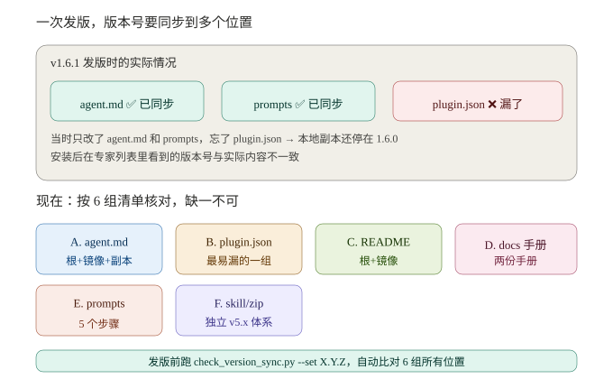

# 效贷功能测试专家 — 管理员指导手册

> **版本**：v1.6.2 | **适用对象**：效贷测试专家管理员 | **更新日期**：2026-08-20

---

## 一、管理员角色与职责

作为效贷测试专家的管理员，你负责以下工作：

| 职责 | 说明 |
|------|------|
| 专家包维护 | 修改专家配置、提示词、脚本，推送到 GitHub 仓库 |
| 花名册管理 | 添加/删除测试人员，控制访问权限 |
| GitHub 仓库管理 | 管理仓库设置、管理员 PAT（仅管理员需要） |
| 数据归集 | 初始化 MySQL 配置，管理团队工时数据集中存储 |
| 定时任务管理 | 维护每日 9:00 / 12:00 / 18:00 的 MySQL 数据同步自动化任务 |
| Confluence 集成 | 确保测试人员环境变量配置正确，处理页面提取故障 |
| 故障排查 | 处理测试人员反馈的安装、身份验证、数据同步、Confluence 提取等问题 |

**管理员身份**：仓库所有者（`hansonzhang0606-ux`）。管理员不是 WorkBuddy 的内置角色，而是"维护专家包源码 + 管理 GitHub 仓库"的人。

---

## 二、专家包架构概览

### 2.1 目录结构

```
xiaodai-testing-expert/                  ← 本地专家包根目录
├── .codebuddy-plugin/
│   └── plugin.json                      ← 专家元数据（版本、标签、快捷入口）
├── agents/
│   └── xiaodai-testing-expert.md        ← Agent 定义（系统提示、工作流 SOP）
├── avatars/
│   └── expert.png                       ← 专家头像（512×512 PNG）
├── skills/
│   └── ai-testcase-workflow-skill/
│       ├── SKILL.md                     ← Skill 入口文档
│       ├── config/
│       │   ├── team_roster.yaml         ← 花名册（盲输入+精确匹配）
│       │   ├── time_tracking_config.yaml ← 时间追踪配置
│       │   ├── defaults.yaml            ← 默认配置
│       │   └── smartsheet_template.yaml ← 智能表格模板（备用）
│       ├── prompts/                     ← 7 步工作流提示词 + Confluence 提取
│       │   ├── document_consolidate.md  ← 本地目录整理（步骤①入口A）
│       │   ├── confluence_extract.md    ← Confluence 页面提取（步骤①入口B）
│       │   ├── requirement_review.md
│       │   ├── testpoint_generate.md
│       │   ├── testcase_refine.md
│       │   ├── knowledge_base_archive.md
│       │   └── time_tracking.md         ← 时间追踪流程定义
│       ├── scripts/                     ← Python 脚本 + 定时任务入口
│       │   ├── record_time_saved.py     ← 记录时间节省数据
│       │   ├── generate_time_analytics.py ← 生成 HTML 分析报告
│       │   ├── sync_to_mysql.py         ← 本地 JSONL → MySQL 幂等同步（v1.5.0 新增）
│       │   ├── sync_roster_to_mysql.py   ← 花名册 yaml → MySQL agent_team_roster（v1.5.2 新增）
│       │   ├── load_roster.py            ← 实时查 MySQL 花名册，AI 身份识别用（v1.5.2 新增）
│       │   ├── biz_line_helper.py        ← 业务线编码解析（v1.5.2 新增）
│       │   ├── init_mysql_config.py      ← 一键生成本机 MySQL 配置（v1.5.0 新增）
│       │   ├── sync_task.bat            ← 定时同步任务入口（v1.5.0 新增）
│       │   ├── sync_to_excel.py         ← Excel 同步脚本（备用）
│       │   ├── convert_to_md.py         ← 文档转换
│       │   ├── generate_review_report.py ← 评审报告生成
│       │   ├── generate_xmind.py        ← 测试点→XMind
│       │   ├── parse_xmind.py           ← XMind 解析
│       │   ├── refine_testcases.py      ← 用例细化
│       │   ├── generate_excel.py        ← Excel 用例生成
│       │   └── config_loader.py         ← 配置加载器
│       └── templates/                   ← 知识库模板、用例模板
└── README.md
```

### 2.2 本地路径

```
C:\Users\kingdee\.workbuddy\plugins\marketplaces\my-experts\plugins\xiaodai-testing-expert\
```

### 2.3 GitHub 仓库结构

```
xiaodai-test-expert/                     ← GitHub 仓库根目录
├── marketplace.json                     ← WorkBuddy 团队市场配置
├── README.md                            ← 仓库说明
├── .gitignore                           ← 忽略规则
├── data/                                ← 历史数据归集目录（v1.5.0 起不再更新，工时数据存 MySQL）
│   ├── data_README.md
│   ├── 吴香康/records.jsonl
│   ├── 周峰/records.jsonl
│   └── 何甜/records.jsonl
└── plugins/
    └── xiaodai-testing-expert/          ← 完整专家包（同本地结构）
```

**仓库地址**：`https://github.com/hansonzhang0606-ux/xiaodai-test-expert`

### 2.4 系统架构与全量流程图（培训专用）

> 本节从顶层视角梳理效贷测试专家涉及的所有工具组件、各自职责，以及测试人员和管理员在各流程节点的介入动作。适合培训时帮助新成员建立全局认知。


#### 2.4.1 组件职责矩阵

整套系统由 6 层组件协作运行，每层承担不同职责：

| 层级 | 组件 | 职责 | 谁维护 |
|------|------|------|--------|
| **平台层** | WorkBuddy 桌面端 | 提供 AI 对话引擎、专家/技能/连接器管理框架、自动化任务调度 | WorkBuddy 官方 |
| **专家层** | 专家包（plugin.json + agent.md + Skill） | 定义专家身份、系统提示、7步工作流 SOP、花名册、时间追踪规则 | 管理员 |
| **分发层** | GitHub 团队市场 | 专家包版本管理与分发、注册脚本下载 | 管理员 |
| **安装层** | 注册脚本（register_expert.bat/sh） | 将专家包从安装市场复制到 my-experts 市场，写入 experts.json 注册记录 | 测试人员执行一次 |
| **集成层** | Confluence MCP 连接器 | 步骤①入口B：读取 Confluence 页面内容（只读） | 测试人员配置一次 |
| **集成层** | 腾讯文档连接器（tencent-docs） | HTML 报告上传到【我的文档】（v1.5.0 起不再用于工时数据同步） | 测试人员授权一次（推荐） |
| **数据层** | MySQL 共享数据库 | 团队工时数据集中存储（v1.5.0 起），定时任务幂等同步 | 管理员初始化 |
| **数据层** | 本地 JSONL | 每步节省时间的本地实时记录（兜底，网络断开时不丢数据） | 自动生成 |
| **数据层** | 用户故事工作目录 | `D:\效贷-产品需求\{编号}-{名称}\`，存放各步骤产出文件 | 自动创建 |
| **执行层** | Python 脚本（10 个） | 文档转换、评审报告生成、XMind 生成/解析、用例细化、Excel 生成、时间记录/分析/同步 | 内置于 Skill |
| **展示层** | HTML 分析报告 | 时间节省可视化报告（含 JS 筛选面板，支持按员工/步骤/日期/故事查询） | 自动生成 |
| **展示层** | 腾讯文档【我的文档】 | HTML 报告在线存储（smartpage 格式），测试人员可随时在线打开 | 自动上传 |
| **访问控制** | 花名册（team_roster.yaml） | 盲输入 + 精确匹配身份验证，控制谁可以使用本专家 | 管理员 |

#### 2.4.2 全量流程图

下图展示完整的数据流和介入节点（颜色说明：**管理员** / **测试人员** / **AI 专家** / **数据工具**）：

```
┌─────────────────────────────────────────────────────────────────────────────┐
│                      效贷测试专家 — 全量流程图                                 │
│            （管理员视角 — 含所有组件和介入节点，培训专用）                       │
├─────────────────────────────────────────────────────────────────────────────┤
│                                                                             │
│  ════ 第一阶段：管理员一次性准备 ════                                         │
│                                                                             │
│  [管理员] 修改专家包源码（本地 my-experts 目录）                               │
│      ↓ 同步 3 个本地副本（sync_expert_copies.py）                             │
│  [管理员] 推送 GitHub 仓库（REST API，3~4 次调用完成全量推送）                   │
│      ↓                                                                     │
│  [管理员] 在专家中输入"初始化时间追踪表格"                                     │
│      ↓ 管理员创建 MySQL 数据库表（agent_time_tracking）                        │
│  [MySQL 共享数据库] 建表完成，管理员将数据库密码告知测试人员                     │
│  [测试人员] 各自运行 init_mysql_config.py 生成本机 mysql_config.json（v1.5.1 起 AI 自动）  │
│      ↓                                                                     │
│  [管理员] 编辑 team_roster.yaml 添加花名册成员 → 同步 MySQL + 推送 GitHub      │
│      ↓                                                                     │
│  [管理员] 确保 Confluence MCP 连接器配置文档可访问                             │
│      ↓                                                                     │
│  [管理员] 通知测试人员安装（发送安装指引）                                      │
│                                                                             │
│  ════ 第二阶段：测试人员一次性安装 ════                                       │
│                                                                             │
│  [测试人员] 添加团队市场（hansonzhang0606-ux/xiaodai-test-expert）             │
│      ↓                                                                     │
│  [测试人员] 安装套件（「技能」→「套件」→ 安装 xiaodai-test-expert）             │
│      ↓                                                                     │
│  [测试人员] 下载并运行注册脚本（register_expert.bat / .sh）                    │
│      ↓ 脚本执行 5 步：定位WB→获取userId→检查套件→复制到my-experts→写入experts.json│
│  [测试人员] 完全退出 WorkBuddy → 重新打开                                      │
│      ↓                                                                     │
│  [测试人员] MySQL 初始化（AI 自动，v1.5.1 起；手动备选 init_mysql_config.py） │
│      ↓                                                                     │
│  [测试人员] (推荐)连接腾讯文档连接器（「连接器」→「腾讯文档个人版」→ 授权）     │
│      ↓                                                                     │
│  [测试人员] 配置 Confluence MCP 连接器（如需 Confluence 入口，按文档配置）       │
│                                                                             │
│  ════ 第三阶段：每次会话流程 ════                                             │
│                                                                             │
│  [测试人员] 进入「专家」→「我的专家」→ 点击「立即使用」                          │
│      ↓ 发送预填欢迎语（defaultInitPrompt）                                    │
│  [AI] 识别预填消息 → 提示输入姓名                                             │
│      ↓                                                                     │
│  [测试人员] 输入真实姓名                                                      │
│      ↓                                                                     │
│  [AI] 实时查 MySQL agent_team_roster 表 → 精确匹配 active 成员（v1.5.2）     │
│      ├─ 匹配成功 → 欢迎用户，缓存姓名到会话上下文                              │
│      └─ 匹配失败 → 拒绝服务，提示联系管理员                                    │
│      ↓                                                                     │
│  [AI] 询问 DMP 用户故事编号和名称                                             │
│      ↓                                                                     │
│  [测试人员] 提供用户故事信息                                                   │
│      ↓                                                                     │
│  [AI] 创建/定位工作目录 D:\效贷-产品需求\{编号}-{名称}\                         │
│      ↓ 缓存到会话上下文，后续步骤自动使用                                      │
│                                                                             │
│  ┌─── 步骤① 文档整理 ─────────────────────────────────────────┐             │
│  │ 入口A（本地目录）:                                            │             │
│  │  [测试人员] 提供目录路径（如 D:\项目文件\效贷\xxx）            │             │
│  │  [AI] Read prompts/document_consolidate.md → 执行整理流程     │             │
│  │  [Python] convert_to_md.py → 转换 Word/PDF/图片/Excel         │             │
│  │                                                              │             │
│  │ 入口B（Confluence）:                                          │             │
│  │  [测试人员] 提供 Confluence URL                               │             │
│  │  [AI] Read prompts/confluence_extract.md → 执行提取流程       │             │
│  │  [Confluence MCP] 读取页面内容 + 下载图片                     │             │
│  │                                                              │             │
│  │ 产出: 整理版 Markdown → 存入工作目录                          │             │
│  │ [测试人员] 检查内容准确性                                     │             │
│  │                                                              │             │
│  │ 时间追踪: [AI]展示参考时间(2~4h) → [测试人员]反馈 → 二次确认  │             │
│  │  [Python] record_time_saved.py → 本地 JSONL                  │             │
│  │  （定时任务每日 12:00/18:00 幂等同步到 MySQL）                 │             │
│  └──────────────────────────────────────────────────────────────┘             │
│      ↓ 不自动推进，等待测试人员指令                                            │
│  ┌─── 步骤② 需求评审 ─────────────────────────────────────────┐             │
│  │  [测试人员] "评审这份需求"                                    │             │
│  │  [AI] Read prompts/requirement_review.md → 6维度自动评审      │             │
│  │  维度: 完整性/一致性/边界/异常/优先级/可测性                  │             │
│  │  [Python] generate_review_report.py → 评审报告 Markdown       │             │
│  │  产出: 评审报告 → 存入工作目录                                │             │
│  │  [测试人员] 阅读评审报告                                      │             │
│  │  时间追踪: 同步骤①流程（参考时间 2~3h）                      │             │
│  └──────────────────────────────────────────────────────────────┘             │
│      ↓                                                                     │
│  ┌─── 步骤③ 确认评审 ─────────────────────────────────────────┐             │
│  │  [测试人员] "确认" / "没问题" → 人工确认                       │             │
│  │  （无时间追踪，纯人工确认节点）                                │             │
│  └──────────────────────────────────────────────────────────────┘             │
│      ↓                                                                     │
│  ┌─── 步骤④ 生成测试点 ───────────────────────────────────────┐             │
│  │  [测试人员] "生成测试点" / "转 XMind"                         │             │
│  │  [AI] Read prompts/testpoint_generate.md → 推导测试点         │             │
│  │  [Python] generate_xmind.py → XMind 脑图文件                  │             │
│  │  产出: XMind 文件 → 存入工作目录                              │             │
│  │  时间追踪: 同步骤①流程（参考时间 3~5h）                      │             │
│  └──────────────────────────────────────────────────────────────┘             │
│      ↓                                                                     │
│  ┌─── 步骤⑤ 评审 XMind ───────────────────────────────────────┐             │
│  │  [测试人员] 用 XMind 软件打开 → 修改测试点（增删改节点）      │             │
│  │  [测试人员] "XMind 评审完了"                                  │             │
│  │  [Python] parse_xmind.py → 解析修改后的 XMind 为 JSON         │             │
│  │  （无时间追踪，纯人工评审节点）                                │             │
│  └──────────────────────────────────────────────────────────────┘             │
│      ↓                                                                     │
│  ┌─── 步骤⑥ 生成用例 ─────────────────────────────────────────┐             │
│  │  [测试人员] "生成用例" / "生成 Excel"                         │             │
│  │  [AI] Read prompts/testcase_refine.md → 细化测试用例          │             │
│  │  [Python] refine_testcases.py → 用例 JSON                     │             │
│  │  [Python] generate_excel.py → 测试用例 Excel                  │             │
│  │  产出: Excel 用例文件 → 存入工作目录                          │             │
│  │  [测试人员] 检查用例准确性                                    │             │
│  │  时间追踪: 同步骤①流程（参考时间 4~8h / 0.5~1人天）          │             │
│  └──────────────────────────────────────────────────────────────┘             │
│      ↓                                                                     │
│  ┌─── 步骤⑦ 入库知识库（可选）────────────────────────────────┐             │
│  │  [测试人员] "入库" / "归档"                                   │             │
│  │  [AI] Read prompts/knowledge_base_archive.md → 总结归档       │             │
│  │  产出: 知识库更新（经验沉淀，供后续复用）                     │             │
│  │  时间追踪: 同步骤①流程（参考时间 1~2h）                      │             │
│  └──────────────────────────────────────────────────────────────┘             │
│                                                                             │
│  ════ 第四阶段：随时可触发 ════                                               │
│                                                                             │
│  [测试人员 或 管理员] "查看时间节省统计"                                      │
│      ↓                                                                     │
│  [AI] 识别身份: 测试人员→个人报告(--person) / 管理员→全量报告                   │
│      ↓                                                                     │
│  [AI] 读取本机 mysql_config.json → 从 MySQL 查询全量数据                       │
│      ↓                                                                     │
│  [Python] generate_time_analytics.py → 生成 HTML 报告                         │
│      ↓                                                                     │
│  [AI] present_files 工具 → 右侧面板打开报告预览                               │
│      ↓                                                                     │
│  [腾讯文档 MCP] 打包 HTML 为 .aipage → 上传到【我的文档】(smartpage)           │
│      ↓ 如已有旧报告，先删除再上传（避免重复）                                  │
│  [AI] 回复: 本地路径 + 腾讯文档在线链接 + 导航路径(更多>我的文件>任务成果)     │
│                                                                             │
│  ════ 第五阶段：管理员日常维护（随时）════                                    │
│                                                                             │
│  [管理员] 查看全量统计报告（不加 --person 参数，展示全业务线数据）              │
│  [管理员] 修改花名册 → 同步 MySQL(sync_roster_to_mysql.py) → 推送 GitHub     │
│  [管理员] 修改专家包 → sync_expert_copies.py 同步3副本 → 推送 GitHub           │
│  [管理员] 运行 check_github_sync.py 自检 → 确认零差异                         │
│  [管理员] 故障排查（安装/身份验证/数据同步/Confluence 提取）                   │
│  [管理员] 版本发布（更新6处版本号 → 同步副本 → 推送 → 更新手册）               │
│                                                                             │
└─────────────────────────────────────────────────────────────────────────────┘
```

#### 2.4.3 介入节点详解

##### 管理员介入节点

| 节点 | 时机 | 管理员做什么 | 涉及工具 |
|------|------|-------------|---------|
| 专家包维护 | 需要更新功能/修复问题时 | 修改 agent.md / prompts / config / scripts，同步3副本，推送 GitHub | WorkBuddy 编辑器、sync_expert_copies.py、GitHub REST API |
| 花名册管理 | 人员变动时 | 编辑 team_roster.yaml（添加/停用），推送 GitHub | 文本编辑器、GitHub REST API |
| 智能表格初始化 | 首次部署时 | 创建 MySQL 数据库表 `agent_time_tracking`，将数据库密码告知测试人员 | MySQL 数据库、init_mysql_config.py |
| Confluence 集成 | 测试人员反馈提取失败时 | 确认 MCP 连接器配置正确、内网可达、认证有效 | WorkBuddy 连接器配置、mcp.json |
| 版本发布 | 功能更新完成后 | 更新6处版本号 → 同步副本 → 推送 → 通知测试人员更新 → 更新手册 | sync_expert_copies.py、check_github_sync.py、push 脚本 |
| 查看全量统计 | 需要评估团队效能时 | 在专家中说"查看时间节省统计"，生成全业务线报告 | generate_time_analytics.py、MySQL 数据库 |
| 故障排查 | 测试人员反馈问题时 | 按 Q1~Q10 排查清单定位问题 | 各类诊断命令、配置文件检查 |

##### 测试人员介入节点

| 节点 | 时机 | 测试人员做什么 | 涉及工具 |
|------|------|-------------|---------|
| 一次性安装 | 首次使用时 | 添加市场 → 安装套件 → 运行注册脚本 → 重启 → MySQL 初始化(AI自动) → (推荐)连接腾讯文档 | WorkBuddy 界面、注册脚本、init_mysql_config.py |
| 身份验证 | 每次会话开始 | 点击「立即使用」→ 发送欢迎语 → 输入真实姓名 | WorkBuddy 专家界面 |
| 确认用户故事 | 每个工作流步骤开始 | 提供 DMP 用户故事编号和名称 | 对话输入 |
| 步骤①提供输入 | 文档整理阶段 | 提供本地目录路径 或 Confluence URL | 对话输入 |
| 步骤①检查产出 | 文档整理完成后 | 检查整理版 Markdown 内容是否准确 | 文件查看 |
| 步骤②阅读报告 | 需求评审完成后 | 阅读6维度评审报告，关注风险和缺失点 | 文件查看 |
| 步骤③确认 | 评审完成后 | 回复"确认"或提出修改意见 | 对话输入 |
| 步骤⑤评审XMind | 测试点生成后 | 用 XMind 软件修改测试点（增删改节点） | XMind 软件 |
| 步骤⑥检查用例 | 用例生成后 | 检查 Excel 中用例的准确性 | Excel 软件 |
| 时间反馈 | 步骤①②④⑥⑦完成后 | 回复节省时间（采纳参考值或自行输入）→ 二次确认 | 对话输入 |
| 查看统计 | 需要查看效能数据时 | 说"查看时间节省统计" | 对话输入 |
| 更新专家 | 管理员通知更新后 | 更新套件 → 重跑注册脚本 → 重启 WorkBuddy | WorkBuddy 界面、注册脚本 |

#### 2.4.4 数据流总结

```
需求文档来源                AI 处理                    产出存储                    数据汇总
┌──────────┐    ┌──────────────────────┐    ┌──────────────────┐    ┌──────────────┐
│本地目录   │───→│                      │───→│工作目录(MD/XMind/ │    │              │
│Word/PDF/ │    │  WorkBuddy 对话引擎   │    │  Excel)          │    │              │
│图片/Excel│    │  + Python 脚本执行    │    │ D:\效贷-产品需求\│    │              │
└──────────┘    │                      │    └──────────────────┘    │              │
┌──────────┐    │                      │                            │ MySQL 数据库 │
│Confluence│───→│                      │───→┌──────────────────┐    │              │
│  页面    │    │                      │    │本地 JSONL(兜底)   │───→│ (定时同步)   │
└──────────┘    └──────────────────────┘    │~/.workbuddy/data/ │    │              │
                         │                  └──────────────────┘    │      ↓       │
                         │                                          │  HTML 报告   │
                         └──────────────────────────────────────────→│  (生成+上传) │
                                                                    └──────────────┘
```

---

## 三、GitHub 仓库管理

### 3.1 测试人员是否需要 GitHub 账号？

**不需要。** 从 v1.5.0 起，工时数据存储在**共享 MySQL 数据库**中，测试人员无需：
- 注册 GitHub 账号
- 被邀请为 Collaborator
- 生成个人 PAT

测试人员只需完成 3 步安装（添加市场 → 安装套件 → 运行注册脚本）+ 1 步 MySQL 初始化（运行 `init_mysql_config.py`），即可使用专家并自动同步工时数据到团队共享 MySQL 数据库。

> **管理员仍需要 GitHub PAT**：用于推送专家包更新到 GitHub 仓库（见 3.2 节）。
>
> **仓库为 Public 时**：测试人员无需 Collaborator 权限即可安装套件。
> **仓库改为 Private 时**：测试人员需被邀请为 Collaborator 才能安装套件（但仍不需要 PAT）。

### 3.2 管理员 PAT 管理与安全

> ⚠️ **从 v1.3.8 起，测试人员不再需要 PAT。** PAT 仅用于管理员推送专家包更新到 GitHub 仓库。

**管理员的 PAT**（用于推送专家包更新）：

1. GitHub → Settings → Developer settings → Fine-grained tokens → Generate new token
2. 配置：
   - **Token name**：`xiaodai-expert-admin`
   - **Repository access**：Only select repositories → `xiaodai-test-expert`
   - **Repository permissions**：
     - Contents → **Read and Write**
     - Metadata → **Read**
3. 生成后保存到安全位置（密码管理器）
4. **定期轮换**：建议每 90 天重新生成

> ⚠️ **重要安全提醒**：
> - PAT 等同于密码，**不要在聊天/邮件/文档中明文传递**
> - 如果 PAT 泄露，立即到 GitHub Settings → Developer settings → Fine-grained tokens 中撤销
> - fine-grained PAT 的 git push 协议可能不兼容，推送专家包更新请使用本章 3.3 节的方法

### 3.3 推送专家包更新到 GitHub

由于 fine-grained PAT 的 git push 协议不兼容，需使用 GitHub REST API 推送。以下是标准推送流程：

**方式一：使用 Python 脚本（推荐）**

```bash
# 1. 设置环境变量
export GITHUB_PAT="你的PAT"

# 2. 运行推送脚本（会自动扫描专家包目录，通过 API 推送全部文件）
"C:\Users\kingdee\.workbuddy\binaries\python\versions\3.13.12\python.exe" \
  push_to_github.py
```

> 推送脚本使用 Git Database API（blobs → tree → commit → ref），3~4 个 API 调用即可完成全部文件推送。

**方式二：单个文件更新（适用于小改动）**

```bash
# 通过 Contents API 更新单个文件
curl -X PUT \
  -H "Authorization: Bearer YOUR_PAT" \
  -H "Content-Type: application/json" \
  -d '{"message":"update team_roster","content":"BASE64_ENCODED_CONTENT","sha":"FILE_SHA"}' \
  "https://api.github.com/repos/hansonzhang0606-ux/xiaodai-test-expert/contents/path/to/file"
```

**方式三：使用 GitHub MCP 连接器**

如果 WorkBuddy 的 GitHub 连接器已连接且有写权限，可直接在对话中说：
> "把专家包的最新改动推送到 GitHub 仓库"

### 3.4 仓库可见性

当前仓库为 **Public**（公开）。这意味着：
- 任何人可以查看专家包代码和结构
- 工时数据存储在 MySQL 共享数据库中，**不在 GitHub 仓库内**

如果需要改为 **Private**（私有）：
1. GitHub → Settings → General → Danger Zone → Change visibility
2. 改为 Private 后，测试人员必须是 Collaborator 才能安装专家（但仍不需要 PAT）

> 仓库可见性不影响工时数据收集——工时数据始终存储在 MySQL 共享数据库中。

### 3.5 Confluence 集成管理

从 v1.3.4 开始，步骤①支持 Confluence 页面提取作为本地目录整理的并行入口。

#### 依赖条件

**已配置 Confluence MCP 连接器**

Confluence 提取能力仅依赖 WorkBuddy 的 Confluence MCP 连接器，**不需要安装额外 skill**。

配置路径：【专家.技能.连接器】-【连接器】-右上角【自定义连接器】-点击【配置MCP】，在 `mcp.json` 中添加 Confluence 连接器配置。

配置方法详见团队 Confluence 中 **《基于workbuddy中配置confluence的MCP》** 文档。

> 管理员只需确保每位测试人员的 WorkBuddy 中已配置并启用了 Confluence MCP 连接器即可。配置一次，长期生效。

#### 管理员排查清单

当测试人员反馈 Confluence 提取失败时：

| 现象 | 检查项 |
|------|--------|
| 提示 MCP 连接器未配置 | 确认测试人员已按配置路径添加 Confluence MCP 连接器 |
| 连接失败 | 确认 MCP 配置中的 Confluence 服务器地址正确、内网可达 |
| 认证失败 401 | 确认 MCP 配置中的用户名/密码或 Token 正确、未过期 |
| 页面 404/403 | 确认 URL 正确、测试人员有页面访问权限 |

#### 安全约束

- Confluence 提取**只读**，不会修改 Confluence 内容
- 不得将内部 Confluence 域名填入提示示例中
- 敏感页面标题需先询问用户确认

---

## 四、花名册管理

### 4.1 花名册文件位置

**本地**：
```
skills/ai-testcase-workflow-skill/config/team_roster.yaml
```

**GitHub**：
```
plugins/xiaodai-testing-expert/skills/ai-testcase-workflow-skill/config/team_roster.yaml
```

### 4.2 花名册格式

> **v1.5.2 起**：`team_roster.yaml` 是「输入源」，运行时身份验证**不再读它**，而是实时查 MySQL `agent_team_roster` 表。管理员改完 yaml 后，**必须运行 `sync_roster_to_mysql.py` 推到 MySQL**（或随专家包推 GitHub），下一次会话启动即生效。

```yaml
# 测试团队花名册（多业务线）
# 业务线编码：XD 效贷 / JWY 泾渭云 / XR 效融 / XXD 小贷
#            ZHJ 智慧记+运营系统 / AIJXC AI进销存 / ZHJLS 智慧记零售

members:
  - name: "吴香康"
    role: "功能测试"
    biz_line_code: ["XD"]        # 可属多条业务线
    active: true

  - name: "何甜"
    role: "功能测试"
    biz_line_code: ["XD", "XR", "XXD"]
    active: true
```

### 4.3 添加新人员

1. 在本地 `team_roster.yaml` 的 `members` 列表中添加新条目：
   ```yaml
   - name: "张三"
     role: "功能测试"
     biz_line_code: ["XD"]
     active: true
   ```
2. 运行 `sync_roster_to_mysql.py` 推到 MySQL `agent_team_roster` 表（全团队即时生效）：
   ```bash
   python scripts/sync_roster_to_mysql.py
   ```
3. 将改动推送到 GitHub（见第三章 3.3 节，随专家包分发）
4. 通知新人员按以下步骤安装：
   - 添加团队市场：**「专家·技能·链接」→「技能」→「套件」→「+」→ 添加市场**，市场源填 `hansonzhang0606-ux/xiaodai-test-expert`
   - 安装套件：在套件列表中找到 "xiaodai-test-expert"，点击「+」安装
   - **运行注册脚本**：
     - Windows：从 https://github.com/hansonzhang0606-ux/xiaodai-test-expert/tree/main/scripts 下载 `register_expert.bat` 和 `register_expert.ps1`（放同一目录），双击 `register_expert.bat` 运行
     - Mac：下载 `register_expert.sh`，终端执行 `chmod +x register_expert.sh && ./register_expert.sh`（不要加 sudo）
   - 重启 WorkBuddy，在「专家」→「我的专家」中确认专家已出现
   - **MySQL 初始化（AI 自动完成，v1.5.1 起）**：首次使用、身份验证通过后 AI 自动检测并索要密码初始化；手动备选：找到专家包 scripts 目录运行 `python init_mysql_config.py --biz-line 效贷`，生成本机 `mysql_config.json`（路径：`~/.workbuddy/data/time-tracking/效贷/mysql_config.json`）
   - **连接腾讯文档连接器（推荐）**：「专家·技能·链接」→「连接器」→ 找到「腾讯文档个人版」→ 点击「连接」并授权（用于在线查看 HTML 报告）

> 从 v1.5.0 起，工时数据通过 MySQL 共享数据库集中存储（取代 v1.4.x 的腾讯文档智能表格）。测试人员无需注册 GitHub 账号或生成 PAT；v1.5.1 起 MySQL 初始化由 AI 自动完成，测试人员无需手动开 CMD。

### 4.4 删除/停用人员

**停用（保留历史数据）**：
```yaml
- name: "周峰"
  role: "功能测试"
  active: false    # 改为 false，身份验证会拒绝
```

**彻底删除**：从 `members` 中移除整个条目。

> 停用比删除更好——保留历史数据可追溯，且如果人员回归只需改回 `true`。

### 4.5 推送花名册更新

修改花名册后，需**两步**才能让所有测试人员生效：

**第一步：同步到 MySQL（v1.5.2，全团队即时生效）**：
```bash
# 运行花名册同步脚本，把 yaml 推到 MySQL agent_team_roster 表
python scripts/sync_roster_to_mysql.py
```
> 运行时身份验证实时查 MySQL，此步完成后所有测试人员下一次会话启动即按新花名册识别。

**第二步：推送到 GitHub（随专家包分发）**：
```bash
# 方法一：整体推送（推荐，确保所有文件同步）
# 使用 3.3 节的 Python 脚本

# 方法二：仅更新花名册文件
curl -X PUT \
  -H "Authorization: Bearer YOUR_PAT" \
  -H "Content-Type: application/json" \
  -d '{"message":"update team roster: add 张三","content":"BASE64_CONTENT","sha":"CURRENT_FILE_SHA"}' \
  "https://api.github.com/repos/hansonzhang0606-ux/xiaodai-test-expert/contents/plugins/xiaodai-testing-expert/skills/ai-testcase-workflow-skill/config/team_roster.yaml"
```

---

## 五、时间数据管理

### 5.1 数据流架构

```
测试人员反馈时间
    ↓
二次确认（专家对话中）
    ↓
record_time_saved.py 写入本地 JSONL（即时写入，兜底）
    ~/.workbuddy/data/time-tracking/效贷/records.jsonl
    ↓
定时任务（每日 12:00 / 18:00）幂等 upsert
    ↓
共享 MySQL 数据库 agent_time_tracking 表
    （唯一键 record_key，重复跑不产生重复数据）
    ↓
报告生成时从 MySQL 查询汇总
```

> **存储模式**：`mysql`（MySQL 共享数据库为主 + 本地 JSONL 兜底）
> **管理员初始化**：创建 MySQL 数据库表 `agent_time_tracking`，将数据库密码告知测试人员，测试人员各自运行 `init_mysql_config.py` 生成本机配置。

### 5.2 关键文件路径

| 文件 | 路径 | 说明 |
|------|------|------|
| 本地 JSONL | `~/.workbuddy/data/time-tracking/效贷/records.jsonl` | 实时记录，兜底 |
| MySQL 配置 | `~/.workbuddy/data/time-tracking/效贷/mysql_config.json` | 本机私有，含数据库密码 |
| MySQL 数据库表 | `agent_time_tracking`（172.20.148.36:3306） | 团队共享，定时同步 |
| 时间追踪配置 | `skills/.../config/time_tracking_config.yaml` | 存储模式、参考时间表 |

### 5.3 MySQL 数据库

MySQL 数据库表 `agent_time_tracking` 包含以下字段：

| 字段名 | json_key | 说明 |
|------|------|------|
| record_key | record_key | 唯一键（幂等去重，重复同步不产生重复数据） |
| 员工姓名 | employee | 员工真实姓名 |
| 用户故事 | user_story | 用户故事编号+名称 |
| 用户故事编号 | user_story_code | DMP 用户故事编号（如 PRJ-00769736） |
| 步骤 | step | 步骤名称 |
| 步骤编码 | step_code | 步骤代码（01/02/04/06/07） |
| 节省小时数 | time_saved_hours | 节省时间（小时，1位小数） |
| 节省人天数 | time_saved_pd | 节省时间（人天，2位小数） |
| 业务线 | biz_line | 本次会话业务线（效贷/小贷/效融，随身份识别动态确定） |
| 备注 | remark | 可选 |
| 记录时间 | recorded_at | 本地记录时间戳 |
| 同步时间 | synced_at | 同步到 MySQL 的时间戳 |

**初始化方法**：

1. 管理员在 MySQL 中创建 `agent_time_tracking` 表（建表 SQL 内置于 `sync_to_mysql.py`，首次运行自动建表）
2. 管理员将数据库连接信息（host、port、用户名、密码）告知每位测试人员
3. 每位测试人员在本机运行 `init_mysql_config.py --biz-line 效贷` 生成本机 `mysql_config.json`

> 数据库连接信息由管理员统一管理，密码通过安全渠道告知测试人员，**不提交到 Git**。

### 5.4 数据格式

每条记录的 JSON 格式：

```json
{
  "date": "2026-08-18",
  "employee": "吴香康",
  "user_story": "US-001-贷款审批流程优化",
  "user_story_code": "PRJ-00769736",
  "step": "文档整理",
  "step_code": "doc_consolidate",
  "time_saved_hours": 4.0,
  "biz_line": "效贷",
  "remark": "原本需手动整理5个文档",
  "recorded_at": "2026-08-18T16:30:00"
}
```

> v1.5.0 起记录自动携带 `user_story_code`（DMP 用户故事编号），便于按故事维度统计。

### 5.5 生成团队汇总报告

**从 MySQL 数据库生成**：

在效贷测试专家中输入：
```
查看时间节省统计
```

AI 会从 MySQL 数据库读取全量数据，生成 HTML 分析报告（含概览卡片、员工/步骤/故事/日期四维度统计、交叉分析表）。

> 报告数据来源：MySQL 数据库（agent_time_tracking 表）。

**从本地数据生成（兜底）**：

```bash
python scripts/generate_time_analytics.py --biz-line "效贷"
```

**报告输出**：
- HTML 报告（含概览卡片、员工/步骤/故事/日期四维度统计、交叉分析表）
- 可选 CSV 导出（`--format csv`）

### 5.6 数据存储单位规范

| 项目 | 规范 |
|------|------|
| 底层存储 | 统一为**小时**（`time_saved_hours` 字段） |
| 报告展示 | 以**人天**为主（1 人天 = 8 小时） |
| 换算公式 | `time_saved_pd = time_saved_hours / 8` |

---

## 六、定时任务管理

### 6.1 现有定时任务

> 从 v1.5.0 起，`storage_mode` 改为 `mysql`（MySQL 共享数据库），数据在本地记录后由定时任务（9:00 / 12:00 / 18:00）幂等同步。

| 任务名称 | 执行时间 | 说明 | 状态 |
|---------|---------|------|------|
| 效贷时间同步-早 | 每天 09:00 | 本地 JSONL → MySQL 幂等同步 | 启用 |
| 效贷时间同步-午 | 每天 12:00 | 本地 JSONL → MySQL 幂等同步 | 启用 |
| 效贷时间同步-晚 | 每天 18:00 | 本地 JSONL → MySQL 幂等同步 | 启用 |

### 6.2 查看定时任务

在 CMD 中执行：

```bat
schtasks /query | findstr 效贷时间同步
```

### 6.3 修改定时任务

如需修改同步时间，使用 `schtasks /change`：

```bat
schtasks /change /tn "效贷时间同步-早" /st 09:30
schtasks /change /tn "效贷时间同步-午" /st 12:30
schtasks /change /tn "效贷时间同步-晚" /st 18:30
```

### 6.4 暂停/恢复定时任务

```bat
:: 暂停（删除任务，数据不会丢失，仍保留在本地 JSONL）
schtasks /delete /tn "效贷时间同步-早" /f
schtasks /delete /tn "效贷时间同步-午" /f
schtasks /delete /tn "效贷时间同步-晚" /f

:: 恢复（重新创建，路径换成实际 scripts 目录）
schtasks /create /tn "效贷时间同步-早" /tr "C:\...\scripts\sync_task.bat" /sc daily /st 09:00 /f
schtasks /create /tn "效贷时间同步-午" /tr "C:\...\scripts\sync_task.bat" /sc daily /st 12:00 /f
schtasks /create /tn "效贷时间同步-晚" /tr "C:\...\scripts\sync_task.bat" /sc daily /st 18:00 /f
```

---

## 七、版本管理与发布流程

### 7.1 版本号规范

采用语义化版本：`MAJOR.MINOR.PATCH`

| 变更类型 | 版本号变化 | 示例 |
|---------|-----------|------|
| 新增功能/重大改动 | MINOR +1 | 1.3.2 → 1.4.0 |
| Bug 修复/小调整 | PATCH +1 | 1.3.2 → 1.3.3 |
| 架构重构 | MAJOR +1 | 1.3.2 → 2.0.0 |

### 7.2 发布流程

```
1. 本地修改专家包文件
   ↓
2. 更新 plugin.json 中的 version 字段
   ↓
3. 更新 agent.md / SKILL.md 中的版本引用
   ↓
4. 本地测试（在 WorkBuddy 中验证功能正常）
   ↓
5. 推送到 GitHub（见第三章 3.3 节）
   ↓
6. 通知测试人员更新（三步：更新套件 → 重新运行注册脚本 → 重启 WorkBuddy）
   ↓
7. 更新使用指导手册（如涉及用户可见变更）
```

> **重要**：由于 v1.3.6 的注册脚本机制（复制专家包到 `my-experts` 目录），测试人员更新套件后**必须重新运行注册脚本**才能同步到 `my-experts`。PAT 不需要重新配置。


### 7.3 版本号同步规则（强制，v1.6.2 补充说明）

> **核心原则：内容改动 = 版本号同步改动 = 所有位置一次改到位**。不要"内容先改、版本号等发版才统一"——
> v1.6.1 教训：当时只改了 agent.md 和 prompts，漏了 plugin.json，导致本地副本版本停在 1.6.0，
> 安装后专家列表显示的版本号与实际内容不一致。

**背景说明**：专家包的"版本号"不是只存在一个文件，而是散落在多个位置。一次发版，以下 6 组位置必须全部同步修改，缺一不可：

| 组 | 包含位置 | 版本号出现处 |
|----|---------|-------------|
| A. agent 组 | 工作区根 `agent.md`、工作区镜像 `xiaodai-testing-expert/agents/xiaodai-testing-expert.md`、GitHub 双镜像同名文件、本地 4 副本同名文件 | frontmatter `description` 版本描述 + 正文引用标注（如"v1.6.2 强化"） |
| B. plugin 组 | 工作区镜像 + 本地 4 副本 + GitHub 双镜像的 `.codebuddy-plugin/plugin.json`（**此文件不在 GitHub 之外的仓库源里，是最容易漏的一组**） | `version` + `description` 条目 + `displayDescription.en/zh` 前缀与条目 |
| C. README 组 | 工作区根 `README.md`、工作区镜像 `xiaodai-testing-expert/README.md`、GitHub 根 README + 双镜像 README | 「专家版本」小节版本号 + 版本历史列表 |
| D. docs 组 | GitHub 根 `docs/` 两份手册 + 本地 marketplace 副本的 `docs/`（my-experts/docs、xiaodai-test-expert-marketplace/docs） | 头部版本行 + 版本历史表格 |
| E. prompts 组 | `skills/ai-testcase-workflow-skill/prompts/*.md` + 工作区镜像/本地副本/GitHub 双镜像对应文件 | 步骤末尾硬指令段版本标注 |
| F. skill/zip 组 | `time-tracking-skill/` + `time-tracking-skill.zip`（本地根 + GitHub 根 + `D:\##AI转型\skills\节省工时追踪skill-自己\`） | 独立 v5.x 体系；仅 skill 自身行为变化才 bump + 重打包（agent 层版本变更禁止写入 skill 文件，也不触发 zip 重打包） |



**强制动作**：
1. 每次改动任何脚本/文档 → **当场**判断所属组 → 该组所有位置（含本地副本、GitHub 双镜像）同步改版本号与内容，再推送。禁止只改工作区源。
2. 发版前跑自检脚本 `check_version_sync.py`（位于仓库 `scripts/` 目录，需先在本地克隆仓库），自动比对 6 组所有位置版本号：
   ```bash
   python scripts/check_version_sync.py --set 1.6.3              # 指定期望版本号
   python scripts/check_version_sync.py --github --set 1.6.3     # 加查远程 GitHub 双镜像（需 GITHUB_PAT）
   python scripts/check_version_sync.py --json                   # 输出 JSON 汇总
   ```
   - 退出码 0 = 全部一致；退出码 1 = 发现不一致（脚本会标红列出具体位置）。
3. `grep -r "v1\.x\.y"` 全目录扫描旧版本号残留（区分历史描述 vs 当前版本号——历史版本条目里的旧版本号是合规的，只有"当前版本号"位置必须一致）。

---

### 7.4 关键配置文件说明


**plugin.json**（专家元数据）：
```json
{
  "name": "xiaodai-testing-expert",
  "version": "1.4.3",          // ← 每次发布更新版本号
  "displayDescription": {
    "zh": "【v1.4.3】效贷业务线功能测试专家..."  // ← 版本号前缀，在专家卡片「能力介绍」中显示
  },
  "defaultInitPrompt": {        // ← 点击「立即使用」后预填到输入框的文本
    "zh": "我是【效贷测试专家】，支持需求整理...服务于效贷/小贷/效融业务线，请告诉我您的姓名，并说明本次处理的业务线（效贷/小贷/效融），进行人员验证，谢谢！",
    "en": "I am the Xiaodai Testing Expert..."
  },
  "tags": [...],                // 专家标签（最多3个）
  "quickPrompts": [...]         // 快捷按钮配置（4个功能操作提示）
}
```

> `defaultInitPrompt` 是用户点击「立即使用」后预填在输入框中的身份验证欢迎语。`quickPrompts` 是"试试这样问我"的功能快捷按钮（4 条：整理目录、提取 Confluence、评审需求、查看统计），两者内容不同。
>
> `displayDescription` 的中文版本前缀 `【vX.X.X】` 会直接显示在专家卡片的"能力介绍"区域，方便用户查看当前版本。

**time_tracking_config.yaml**（时间追踪配置）：
```yaml
storage_mode: "mysql"           // 存储模式：local / excel / cloud / mysql
storage_unit: "hours"           // 底层存储单位
display_unit: "person_days"     // 报告展示单位
```

> v1.5.0 新增 `mysql` 存储模式。MySQL 连接信息存储在本机 `mysql_config.json`（不随专家包分发）。

**team_roster.yaml**（花名册，v1.5.2 起为「输入源」，运行时身份验证实时查 MySQL）：
```yaml
members:
  - name: "姓名"
    role: "功能测试"
    biz_line_code: ["XD"]   # 多业务线编码数组
    active: true/false
```

---

## 八、常见问题与故障排查

### Q1：测试人员安装套件后在「专家」中看不到专家 ✅ 已验证修复

**根因**：WorkBuddy 的 `scanCustomExperts` 函数只扫描 `my-experts` 市场目录（源码常量 `CUSTOM_EXPERT_MY_EXPERT_DIR_NAME = "my-experts"`）。从团队市场安装套件后，专家包只存在于安装市场（如 `xiaodai-test-expert-marketplace`），不会自动复制到 `my-experts`，因此专家不会出现在「专家」标签页。

**解决方案**：让测试人员运行注册脚本（已在 Windows + Mac 验证通过）：

**Windows 用户**：
1. 从 https://github.com/hansonzhang0606-ux/xiaodai-test-expert/tree/main/scripts 下载 `register_expert.bat` 和 `register_expert.ps1`，放到同一目录
2. 双击 `register_expert.bat` 运行
3. 完全退出 WorkBuddy 后重新打开
4. 在「专家」→「我的专家」中确认专家已出现

**Mac 用户**：
1. 下载 `register_expert.sh`
2. 在终端中执行 `chmod +x register_expert.sh && ./register_expert.sh`（不要加 sudo）
3. 完全退出 WorkBuddy（Command+Q）后重新打开
4. 在「专家」→「我的专家」中确认专家已出现

> 脚本执行 5 个步骤：①定位 WorkBuddy 目录 → ②获取 userId → ③检查套件安装 → ④复制专家包到 `my-experts` 市场并创建 `marketplace.json` → ⑤写入 `experts.json` 注册记录。其中第 ④ 步是核心——将专家包从安装市场复制到 `my-experts` 目录，使 `scanCustomExperts` 能扫描到。

> 如果 Windows 用户双击 `.bat` 后提示"找不到 PowerShell"：右键 `register_expert.ps1` → "使用 PowerShell 运行"，或安装 [PowerShell 7](https://aka.ms/powershell)。

**排查步骤**：
1. 确认 GitHub 仓库地址正确：`hansonzhang0606-ux/xiaodai-test-expert`
2. 确认仓库为 Public（或测试人员已被邀请为 Collaborator）
3. 确认套件已安装（「技能」→「套件」→「我安装的」中能看到）
4. 确认注册脚本输出 5 步全部成功（特别注意第 4 步"复制专家包到 my-experts 市场"）
5. 确认已完全退出 WorkBuddy 并重新打开（不是关窗口，是退出进程）

### Q2：测试人员身份验证失败

**排查步骤**：
1. 确认测试人员姓名已同步到 MySQL `agent_team_roster` 表（运行 `sync_roster_to_mysql.py`；或 `load_roster.py --json` 查当前在职名单）
2. 确认该人员在 yaml 中 `active: true`（且已同步 MySQL）
3. 确认姓名精确匹配（包括中文标点）
4. 确认花名册已同步 MySQL + 推送到 GitHub

### Q3：MySQL 数据同步失败

**常见原因**：
- mysql_config.json 未生成 → 测试人员运行 `init_mysql_config.py --biz-line 效贷`
- 数据库连接失败 → 确认电脑在公司内网、密码正确
- 数据库表不存在 → 管理员确认 `agent_time_tracking` 表已创建
- 定时任务未注册 → 检查 `schtasks /query` 确认定时任务存在

**排查步骤**：
1. 确认 `mysql_config.json` 存在（`~/.workbuddy/data/time-tracking/效贷/mysql_config.json`）
2. 确认电脑在公司内网，能访问 MySQL `172.20.148.36:3306`
3. 运行 `python sync_to_mysql.py --dry-run` 试运行，查看错误信息
4. 检查本地 JSONL 是否有数据（`~/.workbuddy/data/time-tracking/效贷/records.jsonl`）

### Q4：测试人员的工时数据没有同步到 MySQL

**排查步骤**：
1. 确认测试人员已运行 `init_mysql_config.py` 生成本机 `mysql_config.json`
2. 确认定时任务已注册（`schtasks /query | findstr 效贷时间同步`）
3. 确认电脑在公司内网，能访问 MySQL `172.20.148.36:3306`
4. 检查本地 JSONL 是否有数据（`~/.workbuddy/data/time-tracking/效贷/records.jsonl`）
5. 手动运行 `python sync_to_mysql.py` 查看错误信息
6. 如果本地有数据但 MySQL 没有，检查密码是否正确、定时任务是否在执行时间开机

### Q5：推送专家包更新到 GitHub 失败

**常见原因**：
- PAT 过期 → 重新生成
- PAT 权限不足 → 确认有 Contents: Read and Write
- git push 协议不兼容 → 改用 REST API 方式（见第三章 3.3 节）
- 网络问题 → 检查网络连接

**验证 PAT 是否有效**：
```bash
curl -sI -H "Authorization: Bearer YOUR_PAT" \
  "https://api.github.com/repos/hansonzhang0606-ux/xiaodai-test-expert" | head -5
```

### Q6：如何回滚到上一个版本

GitHub 仓库保留了完整的提交历史。回滚方法：

1. 在 GitHub 仓库的 Commits 页面找到上一个版本的 commit SHA
2. 使用 API 将 ref 指向该 commit：
```bash
curl -X PATCH \
  -H "Authorization: Bearer YOUR_PAT" \
  -H "Content-Type: application/json" \
  -d '{"sha":"OLD_COMMIT_SHA","force":true}' \
  "https://api.github.com/repos/hansonzhang0606-ux/xiaodai-test-expert/git/refs/heads/main"
```

### Q7：MySQL 定时同步任务没有执行

**排查步骤**：
1. 确认计划任务已注册（`schtasks /query | findstr 效贷时间同步`）
2. 确认电脑在 9:00 / 12:00 / 18:00 处于开机状态（Windows 计划任务依赖开机触发）
3. 手动运行 `python sync_to_mysql.py` 验证脚本本身可用
4. 确认 JSONL 文件路径存在且有数据（`~/.workbuddy/data/time-tracking/效贷/records.jsonl`）
5. 如果脚本报「连接失败」，确认电脑在公司内网、MySQL 密码正确

### Q8：如何添加新的快捷按钮

编辑 `plugin.json` 的 `quickPrompts` 数组：

```json
"quickPrompts": [
  { "en": "...", "zh": "新的快捷指令" }
]
```

推送后测试人员重新打开对话即可看到新按钮。

### Q9：测试人员 Confluence 提取失败，如何快速定位问题

**第一步：确认 MCP 连接器已配置**

让测试人员检查 WorkBuddy 中 Confluence MCP 连接器是否已启用：
- 配置路径：【专家.技能.连接器】-【连接器】-右上角【自定义连接器】-点击【配置MCP】
- 确认 `mcp.json` 中包含 Confluence 连接器配置
- 确认连接器状态为"已连接"

**第二步：确认页面可访问**

让测试人员用浏览器打开 Confluence URL，确认：
- 页面存在
- 测试人员有读取权限
- 网络可达

**第三步：检查错误信息**

专家执行时会输出预检结果，重点关注：
- `MCP 连接器未配置` → 需要按配置路径添加 Confluence MCP 连接器
- `无法连接到 Confluence 服务器` → 服务器地址/网络问题
- `认证失败（401）` → MCP 配置中的用户名/密码问题
- `页面 xxx 返回 404` → URL/权限问题

**第四步：确认 PAT 不影响 Confluence**

Confluence 提取使用 WorkBuddy 的 Confluence MCP 连接器，**不需要 GitHub PAT**，也**不需要安装 confluence-to-md skill**。不要让测试人员混淆三者。

### Q10：Confluence 页面中的敏感信息会泄露吗

- 专家只读取测试人员**明确提供 URL** 的页面
- 不会自动遍历 Space 或子页面
- 提取内容保存在测试人员本地工作目录，不经过第三方服务器
- 页面标题含敏感关键词时会先询问确认

如果企业有更高安全要求，建议将 GitHub 仓库改为 Private（见 3.4 节）。

---

## 九、管理速查卡

```
┌──────────────────────────────────────────────────────────┐
│                效贷测试专家 — 管理员速查卡                    │
├──────────────────────────────────────────────────────────┤
│                                                          │
│  📦 仓库地址   github.com/hansonzhang0606-ux/             │
│               xiaodai-test-expert                         │
│                                                          │
│  📂 本地路径   C:\Users\kingdee\.workbuddy\plugins\        │
│               marketplaces\my-experts\plugins\            │
│               xiaodai-testing-expert\                     │
│                                                          │
│  📋 花名册     skills/.../config/team_roster.yaml         │
│  ⚙️ 追踪配置  skills/.../config/time_tracking_config.yaml │
│  📊 MySQL     172.20.148.36:3306                        │
│               agent_time_tracking 表                      │
│  📄 JSONL     ~/.workbuddy/data/time-tracking/效贷/        │
│               records.jsonl                               │
│  📂 用户故事   D:\效贷-产品需求\{编号}-{名称}\             │
│               (v1.4.0 新增：自动管理工作目录)               │
│  ⏰ 定时任务   效贷时间同步-早 9:00 / 午 12:00 / 晚 18:00            │
│                                                          │
│  ────────────  常用操作  ────────────                     │
│                                                          │
│  添加人员     改 team_roster.yaml → 推送 GitHub → 邀请     │
│  推送更新     Python 脚本 / API / MCP 连接器               │
│  生成报告     generate_time_analytics.py --biz-line 效贷   │
│  Excel 同步   sync_to_excel.py --sync-all                 │
│  暂停定时     automation_update(status=PAUSED)            │
│                                                          │
└──────────────────────────────────────────────────────────┘
```

---

## 十、附录

### A. 脚本速查

| 脚本 | 用途 | 常用命令 |
|------|------|---------|
| record_time_saved.py | 记录时间节省 | `--employee "姓名" --step "步骤" --hours 4 --biz-line "效贷"` |
| generate_time_analytics.py | 生成分析报告 | `--biz-line "效贷" [--input file] [--format csv]` |
| sync_to_excel.py | Excel 同步 | `--init / --append / --sync-all / --read` |
| convert_to_md.py | 文档转换 | `<文件> [--archive]` |
| generate_review_report.py | 评审报告 | `--input <json> --output <md>` |
| generate_xmind.py | 测试点→XMind | `--input <json> --output <xmind>` |
| parse_xmind.py | XMind解析 | `<xmind> -o <json>` |
| refine_testcases.py | 用例细化 | `<json> [参数]` |
| generate_excel.py | Excel用例 | `<json> [参数]` |

### B. GitHub API 速查

| 操作 | 方法 | 端点 |
|------|------|------|
| 获取仓库信息 | GET | `/repos/{owner}/{repo}` |
| 获取文件内容 | GET | `/repos/{owner}/{repo}/contents/{path}` |
| 更新文件 | PUT | `/repos/{owner}/{repo}/contents/{path}` |
| 创建 blob | POST | `/repos/{owner}/{repo}/git/blobs` |
| 创建 tree | POST | `/repos/{owner}/{repo}/git/trees` |
| 创建 commit | POST | `/repos/{owner}/{repo}/git/commits` |
| 更新 ref | PATCH | `/repos/{owner}/{repo}/git/refs/heads/{branch}` |
| 获取目录树 | GET | `/repos/{owner}/{repo}/git/trees/{sha}?recursive=1` |

### C. 版本历史

| 版本 | 日期 | 主要变更 |
|------|------|---------|
| v1.6.2 | 2026-08-20 | **修复时间追踪强制执行漏洞**：测试电脑验证发现 v1.6.0 步骤①完成后 AI 跳过"立即向用户收集节省时间"环节，直接展示"下一步"选项。强化为"**立即触发 + 阻塞下一步**"——完成通报后**必须立即触发**时间数据收集（参考时间展示 + 询问节省了多少时间 + 二次确认 + `record_time_saved.py` 保存），**在收齐时间数据前禁止**展示"下一步选项"或进入下一步骤。变更范围：agent.md 强制约束第 7 条措辞强化；ai-testcase-workflow-skill 5 个步骤 prompts（①/②/④/⑥/⑦）末尾追加"⚠️ 步骤完成后立即触发时间追踪"硬指令段；time_tracking.md 顶部增加"立即+阻塞"强化措辞（v5.3 → v5.4）；time-tracking-skill.zip 重打包同步。管理员视角需关注：测试人员反馈"步骤①后没让我填时间"类问题时，确认对方已升级到 v1.6.2（含 zip v5.4）；**v1.6.2 补充**：新增 7.3 节「版本号同步规则」（6 组同步清单 + check_version_sync.py 自检脚本） |
| v1.6.1 | 2026-08-19 | 时间追踪 skill 层修复（v5.3 同步）：`sync_task.bat` 修复 Windows 兼容性（GBK 编码 + CRLF 换行 + Python 自动探测 + `%~dp0` 定位），解决计划任务触发的 cmd.exe 用 GBK(936) 读取 UTF-8/LF bat 导致中文乱码、找不到命令、路径找不到的问题；定时任务注册由「人工手动」升级为「AI 自动完成」（会话启动自动注册早/午/晚三任务）；同步更新两份指导手册 |
| v1.6.0 | 2026-08-19 | 专家从仅效贷扩展为效贷/小贷/效融三条业务线通用（工作流程一致）；保留「效贷测试专家」名称并泛化开场白；首次无配置时由测试人员选择业务线再初始化 MySQL；知识库改为三业务线各自独立、严格按 biz_line 隔离（小贷/效融向量库待管理员新建）；报告文件名/标题随业务线动态生成 |
| v1.5.2 | 2026-08-19 | **身份识别从读 team_roster.yaml 改为实时查 MySQL `agent_team_roster` 表**；team_roster.yaml 退化为「输入源」（管理员维护后经 `sync_roster_to_mysql.py` 推到 MySQL，多机器/多副本花名册永远最新）；新增 `sync_roster_to_mysql.py`（花名册同步）与 `load_roster.py`（AI 实时拉取在职人员）+ `biz_line_helper.py`（业务线编码解析）；花名册格式改为 `biz_line_code` 数组（多业务线）；会话启动顺序调整为「MySQL 配置检查 → 花名册查询 → 身份验证」；`record_time_saved.py` 校验同步从 yaml 迁到 MySQL；同步更新 6 处版本号 + 两份指导手册 |
| v1.5.1 | 2026-08-19 | MySQL 初始化由「手动开 CMD」升级为「AI 自动完成」：首次使用、身份验证通过后 AI 自动检测并调用 `init_mysql_config.py`（--auto/--employee/--biz-line + 机器可读 JSON），测试人员无需手动开 CMD；支持多业务线映射（效贷/泾渭云/小贷/智慧记零售等），配置已存在时安全跳过 |
| v1.5.0 | 2026-08-18 | 工时数据存储从腾讯文档智能表格改为 MySQL 共享数据库（storage_mode 增加 `mysql`）；本地 JSONL 经每日定时任务（12:00/18:00）幂等 upsert 到 MySQL `agent_time_tracking` 表；新增 `init_mysql_config.py` 一键生成本机配置（含密码，不随专家包分发）；时间记录自动携带用户故事编号（user_story_code）；测试人员安装流程新增「运行 MySQL 初始化脚本」，腾讯文档连接器降级为推荐（仅用于 HTML 报告在线查看）；同步更新两份指导手册，消除腾讯文档 vs MySQL 存储方式矛盾 |
| v1.4.3 | 2026-07-24 | 「查看时间节省统计」回复新增 2 项必告知：①本地 HTML 完整路径（如 `C:\Users\xxx\.workbuddy\data\time-tracking\效贷\time_analytics_效贷.html`）；②腾讯文档导航路径【更多】-【我的文件】-【任务成果】（在该空间/分组下可找到该 HTML 文件）。4 步必做扩展为 5 步必做，回复前自检清单同步扩展为 5 项；同步更新 6 处版本号、两份指导手册 |
| v1.4.2 | 2026-07-24 | 强化「查看时间节省统计」4 步必做流程：①生成本地 HTML → ②present_files 打开 → ③上传腾讯文档 → ④给出链接，未完成禁止回复；步骤④⑥输出文件名加步骤号前缀（4. / 6.）；generate_excel.py 修复后缀长度 bug；同步更新 6 处版本号、两份指导手册 |
| v1.4.1 | 2026-07-24 | 查看时间节省统计时，AI 将本地 HTML 报告打包为 .aipage 导入腾讯文档 smartpage 存放到【我的文档】，测试人员可随时在线打开；report_file_id / report_url 自动回填到 time_tracking_config.yaml；上传失败不阻塞本地报告展示；同步更新 6 处版本号、两份指导手册 |
| v1.4.0 | 2026-07-23 | 新增用户故事目录管理（每步骤确认 DMP 编号，自动创建 `D:\效贷-产品需求\{编号}-{名称}\` 工作目录，所有输出文件统一存入）；修复腾讯文档工时同步空数据问题（record_time_saved.py 输出 CLOUD_SYNC_JSON，AI 转发+验证）；defaultInitPrompt 改为身份验证欢迎语；quickPrompts 保持 4 条（整理目录+Confluence+评审+统计）；displayDescription 加版本号前缀【v1.4.0】；指导手册同步更新 |
| v1.3.9 | 2026-07-23 | 测试人员手册新增「连接腾讯文档连接器」操作步骤（第 4 步）；明确测试人员必须在 WorkBuddy 连接器中授权腾讯文档个人版，否则工时数据无法同步到智能表格；速查卡和 Q8 换电脑流程同步更新 |
| v1.3.8 | 2026-07-23 | 工时数据存储模式从 GitHub 仓库改为腾讯文档智能表格（cloud 模式）；测试人员不再需要 GitHub 账号/PAT/Collaborator 权限；管理员通过"初始化时间追踪表格"一次性创建团队共享智能表格；更新两份指导手册 |
| v1.3.7 | 2026-07-22 | 优化 defaultInitPrompt：点击「立即使用」后预填完整欢迎语（专家能力介绍+身份验证引导），替代原来的"帮我整理需求目录"；agent.md 新增预填开场白识别逻辑和步骤①双入口主动提示规则 |
| v1.3.6 | 2026-07-22 | 新增安装后注册脚本（register_expert.bat/ps1/sh），根因修复：WorkBuddy scanCustomExperts 只扫描 my-experts 市场，脚本自动复制专家包到 my-experts 并创建 marketplace.json + experts.json；新增 Mac 版注册脚本；修复 .bat 中文乱码（改纯 ASCII）、.ps1 编码（加 UTF-8 BOM）、Mac sudo 路径问题；已在 Windows + Mac 验证通过 |
| v1.3.5 | 2026-07-22 | 修复 plugin.json 非标准字段导致安装后专家未显示的问题 |
| v1.3.4 | 2026-07-22 | 新增 Confluence 页面提取作为步骤①替代入口 |
| v1.3.3 | 2026-07-21 | 发布到 GitHub 团队市场，新增数据归集 |
| v1.3.2 | 2026-07-21 | 盲输入身份验证、安全升级 |
| v1.3.1 | 2026-07-21 | 二次确认、统一小时存储、Excel 集中存储 |
| v1.3.0 | 2026-07-21 | 花名册、强制反馈、参考时间、集中存储架构 |
| v1.2.0 | 2026-07-21 | 时间节省追踪功能 |
| v1.1.0 | 2026-07-21 | 替换为真实 Skill |
| v1.0.0 | 2026-07-21 | 初始版本 |

---

*本手册随专家版本同步更新。如有疑问，请在 WorkBuddy 中直接询问。*
